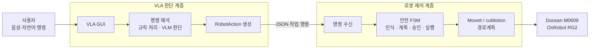
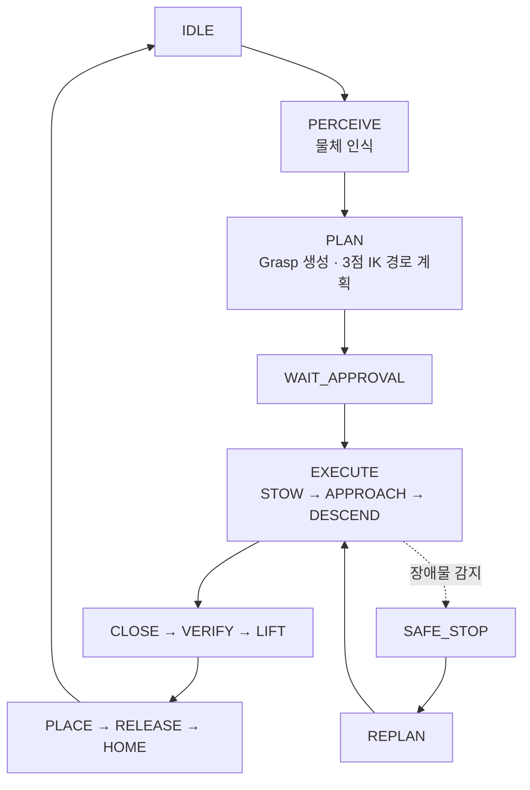

# 🤖 M0609 VLM-Based Unstructured Object Grasping and Dynamic Motion Planning System

## 1. 프로젝트 소개

> **과정:** [두산로보틱스] 지능형 로보틱스 엔지니어 — 협동-2: AI 기반 협동 로봇 작업 어시스턴트 구현

Doosan **M0609** 협동로봇과 **OnRobot RG2** 그리퍼를 기반으로,
사용자의 자연어 지시를 해석하는 **VLA 판단 계층**과 3D 인식·6-DoF 파지·경로계획·안전 실행을 담당하는
**로봇 제어 계층**을 결합한 비정형 물체 파지 및 모션 플래닝 프로젝트입니다.

**VLM(GPT-5-mini)**은 *무엇을 · 몇 개를 · 어디로* 옮길지 판단하고,
**deterministic FSM**은 로봇의 이동·정지·파지·충돌 회피와 같은 실제 동작을 담당합니다.

> **핵심 설계 원칙**: 판단(LLM)과 안전(FSM)을 **한 프로세스에 섞지 않습니다.**
> 두 계층은 JSON 3채널로만 연결되며, 모션 취소 · 그리퍼 개폐 · 물체 보유 상태 · 충돌 씬 관리는 모두 FSM이 담당합니다.
> LLM 응답이 느려지거나 잘못되더라도 팔의 안전 동작에는 영향을 주지 않도록 설계했습니다.

### 명령부터 로봇 동작까지



1. **VLA 판단 계층**은 사용자의 명령과 카메라 영상을 해석해 대상·개수·목적지를 결정합니다.
2. 결정된 작업은 좌표나 관절값이 아닌 **JSON 작업 명령**으로 로봇 제어 계층에 전달됩니다.
3. **안전 FSM**이 인식, 경로계획, 승인, 파지와 이동을 검증한 후 실제 로봇을 구동합니다.

| 역할 | ROS 2 노드 |
| --- | --- |
| 사용자 인터페이스 | `vla_gui` |
| 자연어·영상 판단 | `agent_node` |
| 계층 간 명령 변환 | `vla_pick_bridge_node` |
| 로봇 명령 수신 | `vla_command_node` |
| 안전 상태머신 | `task_manager` (`pick_fsm`) |

| 두 축 | 핵심 책임 | 주요 구현 |
| --- | --- | --- |
| **VLA 판단** | 자연어·영상 맥락에서 대상, 개수, 목적지 결정 | `vla_system`, `vla_interfaces` |
| **로봇 제어** | YOLO-seg, GraspGenX, 3점 IK, MoveIt·cuMotion, RG2, 안전 FSM | `graspgenx_perception`, `pick_fsm`, `cumotion`, `cobot_rg2` |

두 계층은 JSON 경계로만 연결됩니다. LLM은 좌표·관절값·그리퍼·승인·정지를 직접 제어하지 않으며,
로봇 계층은 VLA 없이도 독립적으로 계획·검증할 수 있습니다.

> **검증 범위:** cuMotion·nvblox 연결과 반복 재계획은 프로토타입이며, **움직이는 장애물을 대상으로 한
> 실행 중 회피는 아직 충분한 실기 반복 검증을 완료하지 않았습니다.** 구현과 실기 검증을 같은 의미로 사용하지 않습니다.

로봇 계층의 파지 후보 선정, TF, FSM, 경로계획과 검증 범위는
**[로봇 인식·모션 계층 상세](docs/ROBOTICS_LAYER.md)**에서 확인할 수 있습니다.

---

## 🎬 데모

| 음성 명령 처리 | 장애물 회피 경로 계획 |
| --- | --- |
|  |  |
| "오렌지 집어줘"라는 음성 명령이 파이프라인을 거쳐 실제 pick 동작으로 이어지는 장면입니다. | FSM 상태 · 타겟 · 목적지가 실시간으로 표시되고, RViz에서 octomap 기반 경로가 계획되는 장면입니다. |

---

## 📌 주요 기능 (Key Features)

### 두 축의 핵심 기능

| VLA 판단 계층 | 로봇 인식·모션 계층 |
| --- | --- |
| 자연어·영상 맥락 해석 | D435i·YOLO-seg 기반 대상 인식 |
| 대상·개수·목적지 결정 | GraspGenX 6-DoF 파지 후보 생성·필터링 |
| 대화 기억과 후속 지시 반영 | Approach–Descend–Close–Lift–Place FSM |
| 단순 명령 규칙 처리, 복합 명령 VLM 처리 | MoveIt OMPL 기준선과 cuMotion·nvblox 프로토타입 |
| ROS JSON action 생성 | 승인·정지·재시도·stow 안전 경로 |

### 프로젝트 배경 및 목표

작업 반경에 사람의 손이나 신체가 들어오더라도 위험 경로를 회피하여 **안전성(Safety)**을 확보하고, 사용자의 자연어 지시만으로 물체를 처리해 **편의성(Convenience)**을 높이며, 작업자와의 충돌로 인한 작업 중지를 줄여 **효율성(Efficiency)**을 개선하는 것을 목표로 기획했습니다.

- **Problem**: 물체 위치 인식과 파지 자세 생성이 하나의 흐름으로 연결되어 있지 않았고, 실제 M0609 환경에서 동작 가능한 통합 구조가 필요했습니다.
- **Goal**: 거치형 RealSense로 장애물을 3D로 인식하고 정밀 파지와 경로계획에 반영하며, LLM이 물체 정보를 구체적으로 파악하도록 구현했습니다.

### 구현 및 검증 범위

| 항목 | 상태 | 공개 시 주장 범위 |
| --- | --- | --- |
| D435i·YOLO-seg·GraspGenX 인식 경로 | 구현 | 패키지별 단위·합성·실기 기록을 구분 |
| MoveIt 2 pick-and-place와 안전 FSM | 구현 | 가상·단위·실기 검증 항목을 구분 |
| nvblox·cuMotion 연결 | 구현 | 컨테이너 통신과 계획 파이프라인 연결 |
| 반복 재계획과 실행 궤적 교체 | 프로토타입 | 장애물 없는 조건의 기준선 검증 |
| 움직이는 장애물 실행 중 회피 | **미검증** | 저속 실기 반복 시험 필요 |

### 무엇을 할 수 있나

| 지시 | 동작 |
| --- | --- |
| "사과 바구니에 담아줘" | 인식 → 파지 계획 → 집기 → 바구니에 놓기를 수행합니다. |
| "이거 집어줘" **(손가락으로 가리키며)** | 카메라 사진에서 손가락이 가리키는 물체를 선택해 집습니다. |
| "사과 집어줘" (목적지 없이) | 집은 채로 대기하다가, "테이블에 놔" 또는 "그냥 거기 놔"라는 후속 지시에 따라 놓습니다. |
| "보이는 과일 다 담아줘" | 여러 개를 하나씩 순차적으로 처리합니다. 중간에 "나머지는 테이블로"처럼 지시를 수정할 수 있습니다. |
| "멈춰" | LLM을 거치지 않고 즉시 정지합니다. "계속해" 한 마디로 이어서 진행할 수 있습니다. |
| "컵은 앞으로 담지 마" | 규칙으로 기억하여, 이후 "다 담아줘"라는 지시에서도 컵을 자동으로 제외합니다. |

**VLA GUI** — 음성 명령 입력, 해석된 규칙 · 파이프라인 상태, 판정 모니터링(객체 인식 · 안전 분류 · 파지 후보)을 한 화면에서 확인할 수 있습니다.


---

## 🛠️ 시스템 설계 (System Architecture)

### 전체 구조

시스템은 크게 **인식(Perception)**, **판단(Decision)**, **제어(Control)** 세 부분으로 구성되어 있습니다.

1. **인식(Perception)**: 고정형 RealSense D435i와 YOLO-seg로 대상 물체를 감지하고, eye-to-hand 캘리브레이션(AX = XB)을 통해 카메라 좌표를 로봇 베이스 좌표계로 변환합니다. GraspGenX가 64개의 파지 후보를 생성한 뒤 점수 · 도달 반경 · 접근축 조건으로 필터링하여 최적 파지 자세를 선정합니다.
2. **판단(Decision)**: VLM(GPT-5-mini) 기반 판단 계층이 사용자의 자연어 명령과 카메라 이미지를 함께 해석하여 "무엇을 · 몇 개를 · 어디로" 옮길지 결정합니다. 단순 반복 명령은 Rule 기반으로, 맥락이 필요한 복잡한 명령은 LLM으로 처리하는 하이브리드 구조를 사용합니다.
3. **제어(Control)**: deterministic FSM인 `task_manager`가 24개 상태로 인식 → 계획 → 실행 전체 사이클을 조율하며, MoveIt(OMPL) 또는 cuMotion(GPU 기반)을 통해 M0609 + RG2를 구동합니다. `robot_safety_node`는 FSM과 완전히 독립적으로 동작하여, 메인 FSM이 오류로 멈추더라도 즉시 정지와 제어 복구가 가능하도록 설계했습니다.


### 알고리즘 플로우 차트 (Logic Flow)

Pick FSM의 상태 흐름은 다음과 같습니다.



- 상태 전이 규칙은 `states.py`의 `TRANSITIONS` 한 곳에서만 관리하여 로직이 여러 파일로 흩어지지 않도록 했습니다.
- 계획(PLAN) 단계가 실패하면 차순위 파지 후보로 자동 전환합니다.
- 그립 검증(VERIFY)에 실패하면 그리퍼를 다시 좁혀 재시도합니다.
- `SAFE_STOP`과 `REPLAN` 상태를 분리해 정지 후 재계획 경로를 설계했습니다. 다만 움직이는 장애물을 대상으로 한 실행 중 회피는 프로토타입 단계이며, 실기 검증이 완료된 기능으로 주장하지 않습니다.

실제 운용 중에는 아래와 같은 `rqt` 기반 FSM 제어 패널로 상태 확인, 타겟 지정, 속도 조절, 비상정지, 안전모드 진입을 수행합니다.


---

## 💻 개발 환경 (Environment)

- **OS**: Ubuntu 22.04 LTS
- **Middleware**: ROS 2 Humble Hawksbill
- **Language**: Python 3.10
- **GPU**: NVIDIA GPU + CUDA가 반드시 필요합니다. GraspGenX와 cuMotion은 CPU에서는 동작하지 않습니다. (개발 환경 기준: RTX 4060 Laptop)
- **컨테이너**: Docker + `nvidia-container-toolkit` (`--gpus all` 옵션이 지원되어야 합니다)

## ⚙️ 사용 장비 (Hardware Setup)

| 구성 요소 | 종류 | 사양 |
| --- | --- | --- |
| Robot | Doosan **M0609** | 네임스페이스 `dsr01`, IP `192.168.1.100` |
| Gripper | OnRobot **RG2** | Adaptive Gripper |
| Vision | Intel RealSense **D435i** × 1대 | 🔴 고정형(eye-to-hand)입니다. 작업대 옆에 세워서 설치하며, 로봇 팔에는 부착하지 않습니다. 손목 카메라는 사용하지 않습니다. |
| PC | MSI (RTX 4060 Laptop) | Ubuntu 22.04, GraspGenX · cuMotion GPU 연산용 |

---

## 📂 프로젝트 구성

```
.
├── src/
│   ├── pick_fsm/              상태머신 — 로봇 동작을 총괄하는 단일 주체
│   ├── pick_fsm_msgs/         ComputeGrasp / AcquireTarget 인터페이스
│   ├── voice_processing/      경계 수신부. VLA JSON을 FSM 서비스/토픽으로 전달
│   ├── graspgenx_perception/  인식 + 파지 자세 계산 (YOLO-seg + GraspGen)
│   ├── cumotion/               GPU 플래닝 파이프라인 (선택 사항)
│   ├── object_detection/       YOLO 가중치 share 경로
│   ├── vla_system/             판단 계층 — GUI · 에이전트 · 규칙 · 브리지
│   └── vla_interfaces/         판단 계층 내부 메시지 (경계를 넘지 않습니다)
├── config/                     objects.yaml · cumotion · nvblox 설정
├── docker/                     GraspGenX 컨테이너 구성
├── docs/                       계약 · 실기 제약 · 실행 절차 · 인계 문서
├── scripts/
│   ├── build.sh                빌드 스크립트 (fsm / vla 분리)
│   ├── fetch_externals.sh      외부 저장소 다운로드
│   ├── fsm/                    로봇 쪽 스크립트
│   └── vla/                    판단 쪽 스크립트
├── requirements-vla.txt        판단 계층 파이썬 의존성 (실측 393개)
└── .env.example                API 키 입력 위치
```

### 📁 저장소에 포함되지 않은 항목

| 항목 | 용량 | 안내 |
| --- | --- | --- |
| `isaac_ros-dev/` (cuMotion · nvblox · GraspGenX) | 20G | `scripts/fetch_externals.sh`로 받아주세요. |
| Doosan / OnRobot 드라이버 | 273M | 위와 동일한 방법으로 받아주세요. |
| `.venv/` | 6.6G | `requirements-vla.txt`로 새로 구성해 주세요. |
| `build/ install/ log/` | 1.7G | 절대경로가 포함되어 있어, 위치를 옮기면 정상적으로 동작하지 않습니다. |
| `data/graspgenx_scene/` | 2.3G | 실행 중 생성되는 출력물이며, 입력 데이터가 아닙니다. |
| 도커 이미지 | 7G | `docker/Dockerfile.graspx`로 빌드해 주세요. (빌드 검증 완료) |
| `.env` | — | 🔴 **API 키가 담긴 파일입니다.** `.env.example`을 참고해 작성해 주세요. |

---

## 📦 의존성 설치 (Installation)

```bash
git clone <이 저장소> ~/m0609_vla_ws && cd ~/m0609_vla_ws

# ① 외부 저장소 (GraspGenX · Isaac ROS · Doosan 드라이버)
./scripts/fetch_externals.sh

# ② API 키 설정
cp .env.example .env && chmod 600 .env && $EDITOR .env

# ③ 판단 계층 파이썬 환경 구성
#    🔴 --system-site-packages 옵션이 반드시 필요합니다. 없으면 rclpy를 인식하지 못합니다.
python3 -m venv --system-site-packages .venv
source .venv/bin/activate && pip install -r requirements-vla.txt && deactivate

# ④ 공식 Ultralytics 모델 다운로드
./scripts/fetch_models.sh

# ⑤ 컨테이너 빌드 및 실행 (YOLO-seg + GraspGenX)
#    🔴 마운트 경로는 호스트와 동일해야 합니다.
#       스크립트가 호스트 경로를 컨테이너 내부에서 그대로 source하기 때문입니다.
docker build -f docker/Dockerfile.graspx -t od_kimkh:rebuilt docker
docker run -d --name od_kimkh \
  --gpus all --network host --ipc host \
  -e DISPLAY=$DISPLAY -e ROS_DOMAIN_ID=93 -e RMW_IMPLEMENTATION=rmw_fastrtps_cpp \
  -v /tmp/.X11-unix:/tmp/.X11-unix \
  -v $PWD:$PWD \
  od_kimkh:rebuilt sleep infinity

# ⑥ 장비별 eye-to-hand 캘리브레이션 지정
export M0609_CALIBRATION_FILE=/absolute/path/to/T_cam2base.npy

# ⑦ 빌드
./scripts/build.sh
```

모델 가중치는 저장소에 재배포하지 않습니다. `fetch_models.sh`가 Ultralytics 공식 모델 이름으로
`yolo26s-seg.pt`와 `yolo11n-seg.pt`를 내려받아 각 패키지 경로에 배치합니다. 이전 실험용
`yolov8n_tools_0122.pt`는 공식 출처를 확인할 수 없어 공개 설치 대상에서 제외했습니다.
캘리브레이션 파일 역시 카메라 설치 자세마다 달라지므로 저장소에 포함하지 않습니다.

### 🔴 빌드 시 꼭 지켜주세요

- **`colcon build`를 직접 실행하지 마시고, 반드시 `./scripts/build.sh`를 사용해 주세요.** `vla_system` 패키지는 `.venv` 안의 torch/openai가 필요한데, apt로 설치된 `/usr/bin/colcon`은 venv를 활성화해도 항상 `/usr/bin/python3`를 사용하여 셰뱅에 해당 경로가 고정됩니다. 이 경우 노드가 런타임에 `ModuleNotFoundError: torch` 오류로 종료됩니다. `build.sh`는 셰뱅까지 함께 점검해 줍니다.
- **`.yaml` 파일만 수정하셔도 다시 빌드해 주세요.** `ament_python` 패키지는 share 경로가 `build/`를 참조하기 때문에 `src` 수정 사항이 자동으로 반영되지 않습니다. `.py` 파일은 즉시 반영되므로 혼동하지 않도록 유의해 주세요.
- **`ROS_DOMAIN_ID=93`을 호스트와 컨테이너 모두에 설정해 주세요.** 하나라도 0으로 남아 있으면 토픽이 서로 인식되지 않습니다. 이때 증상이 `perception_node`에서 "no frames processed yet"만 출력되는 것뿐이라 원인을 찾는 데 시간이 오래 걸릴 수 있습니다.

### ⚠️ 주의 사항 (실제 트러블슈팅 경험을 바탕으로 정리했습니다)

| 하지 말아야 할 것 | 대신 이렇게 해주세요 | 이유 |
| --- | --- | --- |
| **호스트**에 `pip install opencv-python` | `apt install python3-opencv` | rclpy와 Qt가 같은 프로세스에서 함께 실행되면 segfault가 발생합니다. 다만 컨테이너는 GUI를 띄우지 않으므로 예외이며, 그곳에서는 pip `opencv-python==4.11.0.86`을 사용합니다. |
| `numpy>=2.0` | `numpy<2` | Humble `cv_bridge`의 컴파일된 확장 모듈이 numpy 1 ABI로 빌드되어 있어 `AttributeError: _ARRAY_API not found` 오류가 발생합니다. |
| `pip install --user` | venv 사용 | apt로 설치된 pytest와 충돌하여 전체 패키지 테스트가 정상적으로 동작하지 않습니다. |

---

## 🚀 실행 순서 (How to Run)

터미널 배치와 전체 실행 순서는 **[docs/RUNBOOK.md](docs/RUNBOOK.md)**가 정본 문서이니 참고해 주세요. 아래는 요약입니다.

```
호스트     bringup(로봇) → RealSense
컨테이너   cumotion segmenter → nvblox → cumotion planner → move_group + RViz
호스트     graspx(YOLO) → graspgenx → pick_fsm → vla_command
판단       vla_gui
```

### 자주 사용하는 서비스

```bash
source install/setup.bash && export ROS_DOMAIN_ID=93

ros2 service call /pick/pause       std_srvs/srv/Trigger {}   # ✋ 되돌릴 수 있는 정지
ros2 service call /pick/resume      std_srvs/srv/Trigger {}   # 이어서 진행
ros2 service call /pick/release_now std_srvs/srv/Trigger {}   # 현재 위치에 놓기
ros2 service call /pick/stow        std_srvs/srv/Trigger {}   # 🔴 종료 전 정리(필수)
ros2 service call /pick/abort       std_srvs/srv/Trigger {}   # 파괴적 중단(SAFE_STOP)
```

🔴 **시스템을 끄기 전에는 반드시 `/pick/stow`를 호출해 주세요.** 물체를 든 상태에서 `Ctrl-C`로 종료하면 그리퍼가 물체를 문 채로 남아 있게 되는데, 이는 물체를 떨어뜨리는 것보다 안전하도록 의도한 설계입니다. `stow` 서비스는 놓을 위치로 먼저 이동한 뒤 물체를 내려놓고 홈으로 복귀합니다. "그리퍼를 열고 홈으로 복귀"를 글자 그대로 수행하면 현재 위치에 물체를 떨어뜨리게 되므로 유의해 주세요.

---

## ✅ 검증 (테스트)

```bash
source /opt/ros/humble/setup.bash && source install/setup.bash
python3 -m pytest src/pick_fsm/test src/voice_processing/test -q

source .venv/bin/activate
python3 -m pytest src/vla_system/test -q
```

테스트는 로봇, 카메라, API 키 없이도 실행할 수 있습니다. 규칙 계층은 표 기반의 가짜 파서로 검증하며, 경계 JSON은 순수 함수로 검사합니다. 따라서 테스트가 실패했다면 LLM의 응답 문제가 아니라 로직 자체에 오류가 있다는 의미입니다.

---

## 🔒 설계에서 반드시 지켜야 하는 것 (불변식)

| 번호 | 불변식 |
| --- | --- |
| I1 | 경계는 **JSON 3채널만** 사용합니다. `vla_interfaces` 메시지는 FSM 쪽으로 전달되지 않습니다. |
| I2 | VLM은 `/pick/approve`(승인)를 호출하지 않습니다 — 이를 위한 코드 경로 자체가 존재하지 않습니다. |
| I4 | **정지 경로에는 LLM이 개입하지 않습니다.** "멈춰" 명령은 GUI에서 로봇으로 직접 전달됩니다. |
| I5 | 물체를 보정하는 동안 그리퍼가 자동으로 열리지 않도록 금지합니다 — 떨어뜨리는 것이 멈추는 것보다 위험하기 때문입니다. |
| I6 | 동시에 진행 중인 action은 1개로 제한합니다. 팔은 하나이기 때문입니다. |
| I7 | 상태 전이는 `states.py` **한 곳에서만** 관리합니다. |
| I11 | `PAUSED` 상태에서는 **자율 동작을 금지합니다.** 시간이 지나도 아무 동작도 발생하지 않습니다. |
| I12 | **시간 경과만으로 팔이 움직이는 경로는 존재하지 않습니다.** |
| I13 | 그리퍼는 팔이 **완전히 멈춘 상태에서만** 열립니다 (출발지는 3곳으로 고정되어 있습니다). |

---

## 📚 더 읽어보시면 좋은 문서

| 문서 | 내용 |
| --- | --- |
| [docs/ROBOTICS_LAYER.md](docs/ROBOTICS_LAYER.md) | **로봇 계층 요약.** 인식·파지·FSM·모션·검증 범위 |
| [docs/vla/A4_INTEGRATION.md](docs/vla/A4_INTEGRATION.md) | VLA 판단 계층과 통합 설계 |
| [docs/RUNBOOK.md](docs/RUNBOOK.md) | 터미널 배치와 실행 순서 (정본 문서) |
| [docs/fsm/vla-bridge-contract.md](docs/fsm/vla-bridge-contract.md) | **경계 계약.** 두 계층을 잇는 JSON 스키마 |
| [docs/fsm/context/constraints.md](docs/fsm/context/constraints.md) | **실제 로봇 운용 중 파악한 사실들.** 설계 문서와 다른 부분을 정리했습니다. |
| [src/PACKAGES.md](src/PACKAGES.md) | 패키지별 상세 내용 · FSM 상태도 정본 |
| [docs/fsm/README.md](docs/fsm/README.md) | 로봇 쪽 문서 지도 — 어떤 사실이 어느 문서에 있는지 |
| [docs/PUBLICATION_CHECKLIST.md](docs/PUBLICATION_CHECKLIST.md) | 공개 전 비밀정보·대용량·라이선스 점검 결과 |
