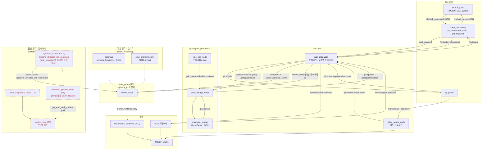
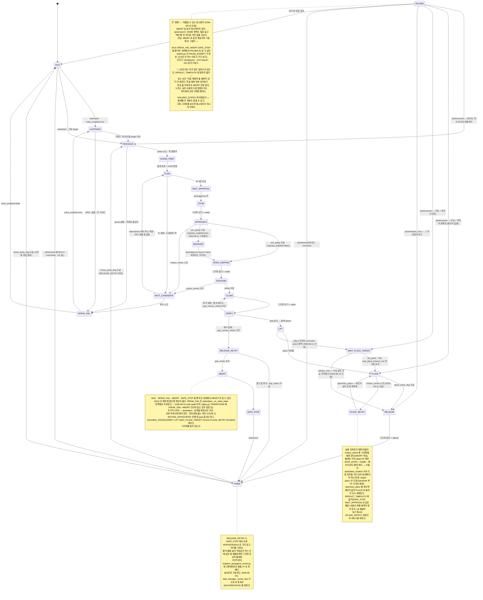

# 패키지 레퍼런스 — cobot2_ws

각 패키지(및 인접 코드)를 어떻게 빌드·실행하고, 인터페이스·파라미터가 무엇인지 다루는
**단일 참조 문서**다. 원래 패키지마다 따로 있던 README 4개(`cobot_rg2`·`cumotion`·
`graspgenx_perception`·`pick_fsm`)를 2026-08-09에 여기로 합쳤다 — 각 패키지 폴더의
`README.md`는 이제 이 문서를 가리키는 포인터만 남아 있다.

**이 문서가 다루는 것과 다루지 않는 것**
- ✅ 각 패키지가 뭘 하는지, 어떻게 빌드·실행하는지, 인터페이스·파라미터가 뭔지, 지금 검증 상태가 어떤지
- ❌ **다른 PC에서 전체 플로우를 처음부터 재현하는 법** → 워크스페이스 루트 `README.md`
- ❌ **날짜별 실기 디버깅 과정·발견·미해결 이슈의 서사** → `md/`의 로그 문서(각 절에서 링크)

## 목차

- [cobot_rg2](#cobot_rg2) — M0609 + RG2 + D435i bringup/MoveIt
- [cumotion](#cumotion) — 실행 중 재계획으로 동적 장애물 회피 (옵션 경로)
- [graspgenx_perception](#graspgenx_perception) — YOLO 인식 + GraspGenX 파지 계산
- [pick_fsm](#pick_fsm) — 음성/타겟 지시 pick 상태머신
- [voice_processing](#voice_processing) — 지시 입력 층 (외부 VLA · 음성) → `/get_keyword`
- [부록: corecode](#부록-corecode--튜토리얼-코드-패키지-아님)

---

## cobot_rg2

*M0609 + RG2 + RealSense D435i(eye-to-hand) 통합 패키지 묶음.*

Doosan M0609 + OnRobot RG2 + RealSense D435i(eye-to-hand) 통합 패키지 묶음.

> **실행 절차·기능확인·트러블슈팅은 워크스페이스 루트 `README.md`에 있다.**
> 이 문서는 **패키지 구성과 설치**만 다룬다. 두 곳에 같은 걸 적으면 한쪽이 먼저 썩는다.

- 최종 갱신: 2026-08-04

---

### 패키지 지도

```
src/cobot_rg2/
├── doosan-robot2/     외부 — read-only. dsr_bringup2 / dsr_controller2 / dsr_hardware2 / dsr_description2 ...
├── onrobot-ros2/      외부 — read-only. onrobot_rg_control (Modbus TCP), onrobot_rg_msgs
└── rg2/               ← 이 ws에서 직접 만든 것
    ├── m0609_rg2_bringup   로봇+그리퍼 bringup, 카메라 드라이버, 캘리브 TF, URDF/xacro
    └── m0609_rg2_moveit    move_group 설정 (SRDF, OMPL, JTC 컨트롤러, octomap)
```

`rg2/` 두 개만 이 워크스페이스가 유지보수한다. 나머지는 업스트림이므로 수정하지 않는다.

#### m0609_rg2_bringup

| 경로 | 내용 |
|---|---|
| `launch/bringup.launch.py` | M0609 + RG2, ros2_control, TF(`world→base_link`), 관측용 RViz |
| `launch/camera.launch.py` | D435i 드라이버 + `base_link→camera_link` static TF (npy에서 매 실행 계산) |
| `launch/bringup_camera.launch.py` | eye-**in**-hand(그리퍼 부착) 변형. 현재 구성(eye-to-hand)에서는 쓰지 않는다 |
| `config/T_cam2base.npy` | 캘리브 결과. `corecode/Calibration_Tutorial/`에서 **수동 `cp`** 로 동기화 |
| `scripts/calib_npy_to_tf.py` | npy → static TF 인자 변환 (OpenCV optical → REP-103 body 규약 보정 포함) |
| `scripts/gripper_virtual_node.py` | virtual 모드 그리퍼 RViz 애니메이션 (Modbus 미포함) |
| `urdf/m0609_with_rg2.urdf.xacro` | 기본 모델. `moveit`도 이 파일을 경로로 직접 읽는다 |

#### m0609_rg2_moveit

| 경로 | 내용 |
|---|---|
| `launch/moveit.launch.py` | move_group + `dsr_moveit_controller`(JTC) + MotionPlanning RViz |
| `config/m0609_rg2.srdf` | 플래닝 그룹, `all-zeros` / `gripper_open` / `gripper_close` |
| `config/moveit_controllers.yaml` | 컨트롤러 이름이 `/dsr01/...` — 네임스페이스와 **짝**이다 |
| `config/sensors_3d.yaml` | RealSense 포인트클라우드 → octomap (3D 장애물). `[튜닝]` 주석 참고 |
| `config/ompl_planning.yaml` | RRTConnect 등 |

---

### 설치

#### 1. 의존성

apt/pip 목록은 워크스페이스 루트 `requirements.txt` 한 곳에 모아뒀다 (apt 블록이 주석으로 들어 있다).

```bash
# apt: requirements.txt 상단 주석의 apt 블록을 그대로 실행
pip3 install -r requirements.txt   # pymodbus만
rosdep install -r --from-paths src --ignore-src --rosdistro humble -y
```

> `onrobot_rg_control`의 `message_runtime` 키는 ROS1 잔재라 rosdep 경고가 뜬다. `-r`로 무시된다.
> ⚠️ 이 랩탑은 계정 공유다. `sudo apt`로 ROS 패키지를 **제거·다운그레이드하지 말 것.** 추가 설치만.

#### 2. 빌드

```bash
cd ~/cobot2_ws
source /opt/ros/humble/setup.bash
colcon build --symlink-install --packages-select m0609_rg2_bringup m0609_rg2_moveit
```

#### 3. 최초 1회 설정

**실기 UDP 포트 권한** (없으면 real 모드 연결 실패):
```bash
echo 'net.ipv4.ip_unprivileged_port_start=0' | sudo tee /etc/sysctl.d/99-ros2-doosan.conf
sudo sysctl --system
```

**RealSense udev rules** (없으면 스트리밍 중 `xioctl(VIDIOC_QBUF) failed — No such device`):
```bash
sudo curl -L https://raw.githubusercontent.com/IntelRealSense/librealsense/master/config/99-realsense-libusb.rules \
  -o /etc/udev/rules.d/99-realsense-libusb.rules
sudo udevadm control --reload-rules && sudo udevadm trigger
```
적용 후 USB 재연결 필요.

**DRCF 에뮬레이터** (`mode:=virtual`에서 `movej` 등 motion service를 쓸 때만):
```bash
sudo usermod -aG docker $USER && newgrp docker
cd src/cobot_rg2/doosan-robot2 && chmod +x install_emulator.sh && sudo ./install_emulator.sh
```

---

### 하드웨어

| 항목 | 값 |
|---|---|
| 로봇 | M0609, 네임스페이스 `dsr01`, IP `192.168.1.100`, port `12345` |
| 그리퍼 | OnRobot RG2, Modbus TCP `192.168.1.1:502` (컴퓨트박스 고정 IP) |
| 카메라 | RealSense D435i, USB. **eye-to-hand** — 로봇에 붙어있지 않다 |

카메라를 옮기면 `T_cam2base.npy`가 전부 무효다 → 루트 README「재캘리브」.

---

### Virtual / Real 그리퍼 차이

| 항목 | real | virtual |
|---|---|---|
| 제어 | OnRobot 드라이버 (Modbus TCP) | 없음 (`gripper_virtual_node` 시각화만) |
| 완료 신호 | 디지털 입력 핀 | `/onrobot/sendCommand` 응답 |
| 파지력·접촉 | 실제 | 시뮬레이션 없음 |
| Tool/TCP 프리셋 | DRCF 등록값 | 스킵 (에뮬레이터 미등록) |

그리퍼는 **MoveIt 컨트롤러가 없다.** `/onrobot/sendCommand` 서비스로 직접 제어한다.

---

### TF 구조 (eye-to-hand, `bringup` + `camera`)

```
world
└── base_link ──────────────────────────── camera_link      (static TF, T_cam2base.npy)
    └── link1 → … → link6 → tool0              └── camera_color_frame / _optical_frame
                             └── rg2_base_link      camera_depth_frame  / _optical_frame
                                 ├── rg2_left_outer_knuckle → inner_knuckle / inner_finger
                                 └── rg2_right_outer_knuckle → inner_knuckle / inner_finger
```

- `world → base_link`: `static_transform_publisher` (identity)
- `base_link → camera_link`: `camera.launch.py`가 npy에서 계산. **하드코딩 금지**
- `tool0 → rg2_base_link`: `joint0` (fixed)
- `rg2_left/right_inner_knuckle`: mimic, `rg2_finger_joint` 기준

> ⚠️ **플래닝 프레임은 `world`가 아니라 `base_link`다.** 장애물 `header.frame_id`도 `base_link`.
> 이유와 증상은 루트 README 8절.

---

### 다음

| 하고 싶은 것 | 문서 |
|---|---|
| 켜고 동작 확인 (로봇/카메라/MoveIt 3터미널) | 루트 `README.md` 3~4절 |
| 회피 경로 테스트 (장애물 놓고 Plan) | 루트 `README.md` 8절 |
| 재캘리브 | 루트 `README.md`「재캘리브」 |
| 실기로 알아낸 제약 | `md/context/constraints.md` |

---

## cumotion

*실행 중 재계획으로 동적 장애물을 회피한다 (옵션 경로 — `config/testcommand.md`의 "경로 A").*

> 날짜별 실기 디버깅 서사(루프 결함 발견·수정, 그리퍼 자기충돌 발견, 복셀 붕괴 조사 등)는
> **[`md/cumotion-experiment-log.md`](../md/cumotion-experiment-log.md)로 옮겼다.** 아래는
> 그 결과로 확정된 레퍼런스(인터페이스·파라미터·배포·증상표)만 남긴다.


실행 명령·검증은 테스트 명령 모음가 단일 출처다. 파이프라인 파라미터(T4~T7 노드 yaml)는
아래 "config 파일 — 작업영역과 노드 파라미터" 절. 여기는 **이 패키지 코드가 왜 이렇게 생겼는지**만 둔다.

| 파일 | 역할 |
|---|---|
| `cumotion/arm.py` | 라이브러리. 계획(MoveGroup 액션) + 실행(FollowJointTrajectory 액션) + 재계획 루프 |
| `cumotion/dynamic_avoid.py` | 실행 노드. `mode` 파라미터로 check/joint/pose/pingpong |
| **`cumotion/reactive_replan.py`** | 🆕 **실험군.** arm.py 를 안 쓰는 독립 단일 파일. 3 Hz 재계획 + JTC 직접 선점교체 |
| **`cumotion/goal_setter_replan.py`** | 🆕 **대조군.** NVIDIA 예제 방식(`plan_only=False`, move_group 이 실행까지) |
| `config/dynamic_avoid.yaml` | 파라미터 기본값 (주석이 본체다) |
| `launch/dynamic_avoid.launch.py` | 자주 바꾸는 것만 launch 인자로 노출 |

---


### config 파일 — 작업영역과 노드 파라미터


실행 순서·검증 명령은 **`config/testcommand.md`** 가 단일 출처다(같은 디렉토리). 여기엔
**무엇을 어디서 고치는지**만 둔다.

> 2026-08-08: `testcommand.md` 가 두 경로를 다 담는다 — **경로 A**(cuMotion+nvblox, 아래 표의
> T4~T7)와 **경로 B**(GraspGenX+pick_fsm, 호스트). 이 파일의 표는 **경로 A 전용**이다.
> 문서 맨 위 "명령어만" 블록에 복붙용 명령이 모여 있다.

#### 파일 지도

| 터미널 | 노드 | 파일 | 적용 방법 |
|---|---|---|---|
| T4 | `robot_segmenter_node` | `cumotion_segmenter.yaml` | `--params-file` |
| T5 | `nvblox_node` | `nvblox_realtime.yaml` | `--params-file` |
| T6 | `cumotion_planner_node` | `cumotion_planner.yaml` | `--params-file` |
| T7 | `move_group` (octomap) | `moveit_sensors_3d.yaml` → **심볼릭 링크** | launch가 패키지에서 자동 로드 |

T7만 링크인 이유: 실물은 `src/cobot_rg2/rg2/m0609_rg2_moveit/config/sensors_3d.yaml`이고
`moveit.launch.py`가 **패키지 share에서** 읽는다. share의 그 파일도 src로의 심볼릭 링크라
**편집하면 빌드 없이 즉시 반영된다.** 여기에 복사본을 두면 두 개의 진실이 생겨서, 고쳤는데
안 먹는 상황이 만들어진다. 링크만 걸어 `config/`에서도 보이게 했다.

#### 작업영역과 감시상자 (base_link 기준, m)

```
              작업영역 (사용자 지정)        감시상자 (= 작업영역 + 0.2 여유)
   x          0.00 ~ 0.70                  -0.20 ~ 0.90
   y         -0.30 ~ 0.30                  -0.50 ~ 0.50
   z          테이블 위 물체                -0.05 ~ 0.70
```

**감시상자를 작업영역보다 넓게 잡는 이유 둘** — ① 팔꿈치·상완은 TCP 작업영역 밖을 지난다,
② 사람 손은 작업영역에 *들어오기 전에* 보여야 피할 시간이 생긴다.

🔴 **cuRobo는 상자 밖을 "자유공간"으로 취급한다.** octomap의 "모르면 막힘"과 반대다.
상자를 좁히면 장애물이 사라지지 계획이 막히지 않는다 — 실패가 조용하다.

복셀 22 × 20 × 15 = **6,600개** (기본 2×2×2 m 상자의 64,000 대비 10%).

##### 상자를 바꿀 때 같이 고쳐야 하는 곳 (하나라도 빠지면 조용히 어긋난다)

| 고치는 곳 | 파일 | 안 맞추면 |
|---|---|---|
| `workspace_bounds_min/max_*` | `nvblox_realtime.yaml` | 지도에 안 들어옴 |
| `grid_center_m` / `grid_size_m` | `cumotion_planner.yaml` | 플래너가 그 영역을 요청 안 함 |
| `projective_integrator_max_integration_distance_m` | `nvblox_realtime.yaml` | 상자 먼 구석이 미관측 |
| `map_clearing_radius_m` | `nvblox_realtime.yaml` | 상자 밖인데 지도에 남음 |

`grid_size_m` 성분은 `voxel_size`(0.05)의 정수배여야 한다 — 아니면 그리드 shape 불일치로
`cumotion_planner.py:432`에서 FATAL. `voxel_size`는 T5/T6가 **같아야** 한다(불일치 시 FATAL).

#### 실행 (컨테이너 T4·T5·T6)

```bash
# 컨테이너 셸마다 먼저
source /opt/ros/humble/setup.bash
source /workspaces/isaac_ros-dev/install/setup.bash
source /workspaces/cobot2_ws/install_container/setup.bash
export ROS_DOMAIN_ID=93

# T4 — 세그멘터

cd /workspaces/isaac_ros-dev && ros2 run isaac_ros_cumotion robot_segmenter_node --ros-args \
  --params-file /workspaces/cobot2_ws/config/cumotion_segmenter.yaml

# T5 — nvblox (리매핑은 params-file로 못 준다. -r 은 명령줄에 남는다)
ros2 run nvblox_ros nvblox_node --ros-args \
  --params-file /workspaces/cobot2_ws/config/nvblox_realtime.yaml \
  -r camera_0/depth/image:=/cumotion/camera_1/world_depth \
  -r camera_0/depth/camera_info:=/camera/camera/aligned_depth_to_color/camera_info

# T6 — 플래너

cd /workspaces/isaac_ros-dev && ros2 run isaac_ros_cumotion cumotion_planner_node --ros-args \
  --params-file /workspaces/cobot2_ws/config/cumotion_planner.yaml

# T7 — move_group (변경 없음. sensors_3d.yaml은 launch가 알아서 읽는다)
ros2 launch m0609_rg2_moveit moveit.launch.py standalone:=false octomap:=true cumotion:=true
```

`use_color: false`로 바꿨으므로 T5의 color 리매핑 2줄은 이제 필요 없다.

⚠️ **nvblox 파라미터는 노드 생성 시 1회만 읽는다**(`nvblox_node.cpp:195`).
`ros2 param set`으로는 안 바뀐다 — 고쳤으면 T5를 재시작한다.
T4·T6도 마찬가지로 재시작이 필요하다.

#### 증상 → 어느 파일을 볼 것인가

| 증상 | 파일 | 파라미터 |
|---|---|---|
| 장애물이 사라졌는데 복셀이 남는다 | T5 | `tsdf_decay_factor`, `decay_tsdf_rate_hz`, `tsdf_set_free_distance_on_decayed` |
| 로봇에 가까이 간 손이 안 보인다 | T4 | `distance_threshold` |
| 로봇 몸이 장애물로 잡힌다 | T4 | `distance_threshold` (반대 방향) |
| 상자 밖 장애물을 통과한다 | T5+T6 | 감시상자 범위 (위 표) |
| 쓸데없는 복셀이 많다 | T5 | `workspace_bounds_*`, `max_integration_distance_m`, `esdf_integrator_max_site_distance_vox` |
| 계획이 자주 실패한다 | T6 | `max_attempts`, `num_trajopt_seeds` |
| 계획은 되는데 장애물을 통과한다 | T6 | `read_esdf_world` (False면 이 증상) |
| OMPL(octomap)만 이상하다 | T7 | `moveit_sensors_3d.yaml` |

#### 아직 안 된 것 (config 튜닝 관련)

- **이 설정으로 실기를 안 돌렸다.** 값의 출처는 소스 코드와 계산이지 실측이 아니다.
- **z 하한 -0.05는 "base_link의 z=0이 테이블 상판"이라는 가정**에 서 있다. 틀리면
  테이블이 지도에서 빠지고 팔이 상판을 뚫는 경로가 나온다. 실기 전에 확인할 것.
- **실행 중 동적 회피는 여전히 안 된다.** T6은 계획 요청 1회당 지도를 1번만 읽는다.
  지도를 실시간으로 만든 것은 그 다음 단계(실행 중 재계획 루프)의 전제 조건일 뿐이다.
- 파이프라인 지연 하한 ≈ 0.6초 (카메라 0.10 + 세그멘터 0.27 + nvblox 0.1 + 계획 0.11).
  세그멘터 3.7 Hz가 병목이다.

---

### 1. 🔴 왜 "루프"인가 — 이 패키지의 존재 이유

`cumotion_planner_node` 는 **계획 요청 1건당 ESDF 를 딱 1번** 읽는다
(`cumotion_planner.yaml` 의 `update_esdf_on_request` 주석, `cumotion_planner.py:621`).

> 궤적이 한 번 만들어지고 나면, 실행 중에 사람이 걸어 들어와도 cuMotion 은 모른다.

즉 **nvblox 지도를 실시간으로 만든 것만으로는 실시간 회피가 안 된다.** 지도는 재료일 뿐이고,
회피는 *이 노드가 계획을 계속 다시 시키고 실행 중인 궤적을 갈아끼울 때* 비로소 생긴다.
위 "config 파일" 절의 "아직 안 된 것" 마지막 항목("실행 중 동적 회피는 여전히 안 된다 …
그 다음 단계(실행 중 재계획 루프)의 전제 조건일 뿐")이 가리키는 게 정확히 이 패키지다.

```
                        ┌──────── 3 Hz 로 반복 ────────┐
현재/예측 상태 ──▶ plan() ──▶ nvblox ESDF pull ──▶ 새 궤적 ──▶ JTC 로 교체 발행 ──┘
                                                              (기존 goal 은 JTC 가 선점)
```

### 2. 🔴 이 노드는 nvblox 를 구독하지 않는다

가장 헷갈리는 지점이다. **장애물 데이터는 이 노드를 안 거친다.**

```
nvblox_node ──서비스── /nvblox_node/get_esdf_and_gradient
                           ▲  cumotion_planner_node 가 pull 한다
                           │  (cumotion_planner.yaml: read_esdf_world: true,
                           │   esdf_service_name, update_esdf_on_request: true)
                    cumotion_planner_node ── cuRobo 충돌월드
                           ▲ /cumotion/move_group
                    move_group (cuMotion 플러그인)
                           ▲ /move_action  ← 이 노드는 여기만 잡는다
                    dynamic_avoid
```

우리가 ESDF 를 받아서 플래너에 넘겨주는 구조가 **아니다.** `cumotion_planner_node` 가
자기 요청을 처리하는 도중에 nvblox 에 직접 서비스 콜을 날린다. 그래서:

> **`plan()` 호출 그 자체가 nvblox 에 ESDF 를 물어보는 트리거다.**
> "장애물을 다시 본다" = "`plan()` 을 다시 부른다" — 1절의 루프가 회피를 만드는 이유가 이것이다.

(직접 구독해서 MoveIt collision object 로 넘기는 방식은 `motion_planning/nvblox_bbox_bridge.py`
가 하는 **별개 접근**이다. OMPL/octomap 경로용이고 cuMotion 경로와 섞으면 안 된다.)

#### 그래서 감시가 따로 필요하다

🔴 **nvblox 가 죽어도 계획은 성공한다.** 장애물이 없는 세상에서 계획할 뿐이다.
계획 성공/실패로는 절대 드러나지 않고, 로봇이 장애물을 통과한 뒤에야 안다.
`testcommand.md` 가 "성공처럼 보이는 실패"라 부르는 그것이다. 그래서 두 겹을 넣었다:

| 무엇 | 어떻게 | 걸리면 |
|---|---|---|
| ESDF 서비스 존재 (`check_obstacle_pipeline()`) | `esdf_service_name` 이 실제로 떠 있는지 | `require_obstacle_pipeline: true` 면 **이동을 거부**한다 |
| cuMotion 이 실제로 본 복셀 (`/curobo/voxels`) | 궤적 교체마다 복셀 수를 로그에 남긴다 | 0개면 "nvblox 는 살아 있어도 지도가 비었다" 경고 |

⚠️ 서비스 존재 확인은 nvblox 가 *떠 있다*는 것만 본다. `esdf_mode` 가 `2d` 면 nvblox 는
cuMotion 첫 요청에 FATAL 로 죽는데, 그건 첫 계획을 실제로 던져 봐야 드러난다 —
`mode:=check` 가 계획을 1회 던지는 이유다.

⚠️ `/curobo/voxels` 는 **계획 요청을 처리하는 중에만** 발행된다(`testcommand.md` 8절).
대기 중에 `topic hz` 로 확인하려 들면 안 나온다.

`pipeline_id:=ompl` 로 쓸 땐 nvblox 가 필요 없으므로 `require_obstacle_pipeline:=false` 로 내린다.

### 3. 전부 표준 ROS 2 인터페이스다

| 하는 일 | 인터페이스 |
|---|---|
| 계획 | `/move_action` — 액션 `moveit_msgs/action/MoveGroup` (`pipeline_id: isaac_ros_cumotion`, `plan_only: true`) |
| 실행 | `/dsr01/dsr_moveit_controller/follow_joint_trajectory` — 액션 `control_msgs/action/FollowJointTrajectory` |
| 상태 | `/joint_states` — 토픽 `sensor_msgs/msg/JointState` |
| 정지 | `/dsr01/motion/move_stop` — 서비스 `dsr_msgs2/srv/MoveStop` |

RViz MotionPlanning 패널이 쓰는 것과 같은 진입점이고, GUI 대신 이 노드가 클라이언트다.

#### 🔴 왜 `moveit_py` 가 아니라 액션 클라이언트인가

`ARCHITECTURE.md` 2절이 권하는 `moveit_py` 는 **이 루프에는 못 쓴다.** 셋 다 치명적이다:

1. **`moveit_py.execute()` 가 MoveIt 실행 관리자를 탄다** → `allowed_start_tolerance` 검사에 걸려
   움직이는 중의 궤적 교체가 거부될 수 있다.
   🔴 **2026-08-08 정정: 여기 적혀 있던 "0.01 rad" 는 틀린 값이다.** 그건
   `dsr_moveit_config_m0609`(두산 원본)의 값이고, **T7 이 실제로 쓰는
   `m0609_rg2_moveit/config/moveit_controllers.yaml` 은 `0.08`**(≈4.6°)로 훨씬 관대하다.
   따라서 "**매번** 거부된다"는 과장이었다. 액션 클라이언트를 쓰는 진짜 이유는 ②다 — ⭐절 참고.
2. **실행 중 궤적을 선점 교체하는 API 가 없다.** plan→execute 순차 모델이라 표현 자체가 안 된다.
3. **프로세스 안에 RobotModel/PlanningScene 을 또 띄운다** → `move_group` 의 파라미터 일습
   (robot_description·SRDF·kinematics·planning_pipelines)을 이 노드에도 똑같이 먹여야 한다.
   액션 클라이언트는 이미 떠 있는 `move_group` 에 붙기만 하면 된다.

JTC 액션을 직접 부르면 ① 의 검사가 없고, 새 goal 이 오면 JTC 가 기존 goal 을 스스로 선점한다.
`plan_only: true` 로 궤적만 받아오는 이유가 이것이다.

⚠️ 컨트롤러 이름 앞의 `/dsr01/` 은 오타가 아니다. bringup 의 `controller_manager` 가
`dsr01` 네임스페이스에 있어서 액션도 그 밑에 뜬다.

### 4. 인계(handover) 타이밍 — 세 파라미터가 전부다

계획 1회에 wall **204 ms**(`testcommand.md` 9절 실측). 그동안 로봇은 계속 움직인다.
그래서 "지금 상태"로 계획하면 결과가 나올 땐 이미 그 지점을 지나쳐 있다 → 인계 시 점프.

| 파라미터 | 기본 | 의미 | 어긋나면 |
|---|---|---|---|
| `lookahead_s` | 0.35 s | **미래 시점**의 궤적 위 상태에서 계획을 시작 | 작으면 "새 궤적 시작점이 실측과 어긋남" 경고 후 폐기 |
| `handover_s` | 0.05 s | 새 궤적을 뒤로 밀어 JTC 가 보간해 올라타게 함 | 0 이면 즉시 점프, 크면 반응이 느려짐 |
| `replan_hz` | 3.0 Hz | 재계획 주파수 | 위로 올려도 **새 정보가 없다** (아래) |

🔴 **`lookahead_s > 계획시간 + handover_s`** 가 성립해야 루프가 돈다. 0.35 는 204 ms + 여유다.
`vel_scale` 을 올리면 같은 시간에 더 멀리 가므로 `lookahead_s` 도 같이 올려야 한다.
`mode:=check` 가 실측 계획시간과 비교해서 이 조건을 자동으로 경고해준다.

#### 🔴 다만 lookahead 로 고쳐지는 건 **위치뿐**이다

**cuMotion 은 우리가 보낸 시작 velocity 를 버린다.** `cumotion_planner.py:675` 가
`CuJointState.from_position(position=, joint_names=)` 로만 시작상태를 만들어 velocity 가 0 으로
채워지고, `is_diff=False` 라 라이브 `/joint_states` 를 읽는 686~698 분기도 타지 않는다.

> 새 궤적의 **첫 점 velocity 는 언제나 0** 이다. 로봇이 달리는 중에 "정지 상태에서 출발하는"
> 궤적을 인계받으므로, 교체마다 속도 불연속이 남는다.

이건 튜닝 실패가 아니라 플래너의 성질이라 `lookahead_s` 를 아무리 키워도 안 없어진다.
할 수 있는 건 셋뿐이다 — **`handover_s` ↑ / `replan_hz` ↓ / `vel_scale` ↓.**
크기는 눈으로 재지 말고 교체 로그와 `summary()` 의 **`이음새 N rad/s`**(교체 순간의 실측
관절속도 최대성분 = 불연속의 크기) 로 본다. 0 에 가까울수록 매끄럽다.

⚠️ `start_pos` 를 아예 안 주면(`is_diff=True`) cuMotion 이 `/joint_states` 의 실제 velocity 를
읽는다(`:694-698`). 대신 lookahead 가 사라져 204 ms 뒤처진 상태로 계획하게 되므로,
이 루프에서는 그쪽 손해가 더 크다고 보고 현재 구조를 유지한다.

🔴 **3 Hz 위로 올리는 건 의미가 없다.** `robot_segmenter_node` 가 3.7 Hz 라
nvblox 지도 자체가 그 속도로만 갱신된다(위 "config 파일" 절의 병목 항목). GPU 부하만 늘어난다.

### 5. 안전 — 코드가 하는 것과 사람이 해야 하는 것

코드가 하는 것:
- **장애물 경로 gate** (`require_obstacle_pipeline`, 기본 true): ESDF 서비스가 없으면
  **이동을 거부**한다. nvblox 없이도 계획은 성공하므로 이게 없으면 통과한 뒤에야 안다 (2절)
- **시작점 점프 검사** (`max_start_jump`, 0.25 rad): 예측이 빗나간 궤적은 발행하지 않고 버린다
- **연속 실패 차단** (`max_consecutive_failures`, 4회): 감속 정지 후 종료
- **감속 정지** (`brake()`): goal 을 cancel 하면 JTC 가 그 자리를 홀드해 급정지가 된다.
  정상 종료 경로에서는 현재 속도에서 0 까지 등감속하는 짧은 궤적을 대신 쏜다
- **비상정지** (`emergency_stop()`): `/dsr01/motion/move_stop`, 기본 Soft stop

사람이 해야 하는 것:
- **`mode:=check` 를 먼저** 돌린다. 여기서 걸리는 게 실기에서 걸리는 것보다 싸다
- **첫 실행은 `vel:=0.15`**, 비상정지 버튼에 손을 올린 채로
- `pingpong_a_deg`/`pingpong_b_deg` 를 **`mode:=joint` 로 각각 따로 한 번씩** 가보고 눈으로 확인
- ⚠️ **루프가 도는 동안 `movej`/`movel` 을 부르지 말 것.** MoveIt 경로와 두산 네이티브 모션
  서비스가 **같은 DRFL TCP 연결 하나**를 공유한다(`ARCHITECTURE.md` 3절). 모션 모드가 충돌한다

### 6. 이 패키지를 어디에 두고 어디서 돌리나

#### 결론

**GPU PC 호스트의 `~/cobot2_ws/src/cumotion/`.** 컨테이너 안에서 빌드·실행한다.

`testcommand.md` 3절의 기동 명령이 이미 그 디렉토리를 마운트하고 있어서 추가 설정이 없다:

```bash
./run_dev.sh -a "-v $HOME/cobot2_ws:/workspaces/cobot2_ws"
#                   └─ 호스트 ~/cobot2_ws  →  컨테이너 /workspaces/cobot2_ws
```

🔴 **컨테이너에서 돌릴 거면 마운트된 경로 안에 있어야 한다.** 도커는 마운트 안 된 호스트
디렉토리를 아예 못 본다. 다른 곳에 두려면 `-v` 를 하나 더 붙인다:

```bash
./run_dev.sh -a "-v $HOME/cobot2_ws:/workspaces/cobot2_ws -v $HOME/내경로:/workspaces/mypkg"
```

⚠️ `run_dev.sh` 는 컨테이너를 재사용하지 않고 **매번 새로 만든다**(`testcommand.md` 3절).
마운트는 띄울 때마다 붙여야 하고, 그래서 마운트를 늘릴수록 기동 명령이 길어진다.

#### 왜 `~/cobot2_ws` 인가 — 기능이 아니라 관리 때문이다

이 패키지의 `esdf_service_name` · `base_frame` · `voxel_topic` 은 `config/` 의
`cumotion_planner.yaml` / `nvblox_realtime.yaml` 과 **짝을 맞춰야 하는 값**들이다
(어긋나면 에러 없이 조용히 장애물을 놓친다 — 2절). 같은 트리 안에 있어야 같이 고친다.

#### 🔴 호스트에서 돌려도 된다

이 패키지는 **GPU 를 안 쓴다.** CUDA·curobo·moveit 코어 라이브러리 전부 무관하고,
필요한 건 메시지 패키지뿐이다(순수 액션 클라이언트라서 — 3절).

```bash
# 호스트에서 이 4개가 다 나오면 호스트 실행 가능
ros2 pkg list | grep -E "^(moveit_msgs|control_msgs|visualization_msgs|dsr_msgs2)$"
# moveit_msgs 가 없으면:  sudo apt install ros-humble-moveit-msgs
```

호스트 실행의 이점: 컨테이너를 새로 띄울 때마다 재빌드할 필요가 없고, 비상정지용
`dsr_msgs2` 가 호스트엔 확실히 있다(bringup 이 쓴다).

**어디서 돌리든 통신은 된다.** 이 노드는 `/move_action`(컨테이너)과 `/dsr01/...`(호스트)을
동시에 잡아야 하는데, T7 move_group 이 컨테이너에서 호스트 `controller_manager` 를 이미
그렇게 쓰고 있으니 검증된 경로다. 단 둘은 지킨다:

- `export ROS_DOMAIN_ID=93` — 호스트·컨테이너 양쪽 다
- ⚠️ **`RMW_IMPLEMENTATION` 을 건드리지 말 것.** cycloneddds 로 바꾸면 컨테이너↔호스트
  **서비스**가 안 붙는다(토픽만 됨). `check_obstacle_pipeline()` 도 서비스 조회라 같이 깨지고,
  그러면 "nvblox 가 없다"고 오판해서 이동을 거부한다.

#### 빌드

```bash
# 컨테이너 T8
source /opt/ros/humble/setup.bash
source /workspaces/isaac_ros-dev/install/setup.bash
export ROS_DOMAIN_ID=93

cd /workspaces/cobot2_ws
colcon build --symlink-install --build-base build_container \
             --install-base install_container --packages-select cumotion
source install_container/setup.bash
```

⚠️ **`install_container` 를 따로 쓰는 이유가 있다.** 호스트와 컨테이너가 같은 `install/` 에
빌드하면 파이썬 경로·ABI 가 섞여 한쪽이 깨진다. 호스트에서도 빌드할 거면 호스트는
기본 `build/`·`install/` 를, 컨테이너는 `build_container/`·`install_container/` 를 쓴다.

`--symlink-install` 이면 파이썬 파일과 yaml 을 고쳐도 **재빌드 없이** 반영된다(노드 재시작만).
호스트에서 편집하면 마운트를 통해 컨테이너에 즉시 보인다.

#### 🔴 0 에서 시작하는 전체 기동 순서 (2026-08-07 실기 관통 확인)

> **T1~T7 은 `config/testcommand.md` 의 발췌다.** 그쪽이 단일 출처이고, 어긋나면 그쪽이 이긴다.
> 여기 두는 이유는 T8(이 패키지)만 따로 보면 못 돌리기 때문이다. **T8 절은 여기가 주인이다.**

터미널 8개. **T2(실기 로봇)는 사람이 직접 띄운다.**

##### 호스트 터미널 — 매 터미널 첫 줄

```bash
cd ~/cobot2_ws && source /opt/ros/humble/setup.bash && source install/setup.bash
export ROS_DOMAIN_ID=93
```
🔴 **`ROS_DOMAIN_ID` 를 빠뜨리면 노드가 하나도 안 보인다.** 2026-08-07 에 T8 에서 실제로 겪었다 —
`/move_action 액션 서버 없음` 으로 나와서 T7 이 죽은 줄 알았는데 도메인이 0 이었던 것뿐이다.

```bash
# T1 카메라
ros2 launch m0609_rg2_bringup camera.launch.py depth_profile:=848x480x15 color_profile:=848x480x15
#   확인: ros2 topic hz /camera/camera/aligned_depth_to_color/image_raw   → 10~15 Hz
#   확인: ros2 node list | grep -c "camera/camera"                        → 1 (2면 depth 반토막)

# T2 실기 로봇  ← 사람이 띄운다
ros2 launch m0609_rg2_bringup bringup.launch.py mode:=real host:=192.168.1.100 rviz:=false
#   확인: ros2 topic echo /joint_states --once   → name/position/velocity 각 12개
#   🔴 velocity 가 비어 있으면 cuMotion 계획이 전부 실패한다
```

##### T3 — 컨테이너

```bash
export ROS_DOMAIN_ID=93          # ⚠️ run_dev.sh 가 -e 로 넘긴다. 먼저 해야 한다
cd ~/cobot2_ws/isaac_ros-dev/src/isaac_ros_common/scripts
./run_dev.sh -a "-v $HOME/cobot2_ws:/workspaces/cobot2_ws"
```

🔴 **`run_dev.sh` 는 `docker run -it --rm` 이다 — 그 터미널을 닫으면 컨테이너가 통째로 삭제된다.**
이미 떠 있으면 `docker exec -it isaac_ros_dev-x86_64-container bash` 로 들어간다(새로 안 만든다).

**새 컨테이너면 맨 처음 한 번:**
```bash
bash /workspaces/cobot2_ws/scripts/container_setup.sh    # warp 1.5.0 / numpy 1.26.4 / cv2 OK
```
🔴 **이걸 빠뜨리면 T4 는 `import cv2 → _ARRAY_API not found`, T6 은 `module 'warp' has no
attribute 'torch'` 로 죽는다.** 2026-08-07 에 둘 다 겪었다. 컨테이너를 새로 만들 때마다 매번이다.
(출력의 `🔴 패치가 없다` 줄은 git `dubious ownership` 오탐이니 무시 — curobo 패치 2개는 살아 있다)

##### 컨테이너 셸 — T4~T7 매 셸 첫 줄

```bash
source /opt/ros/humble/setup.bash
source /workspaces/isaac_ros-dev/install/setup.bash
source /workspaces/cobot2_ws/install_container/setup.bash
export ROS_DOMAIN_ID=93
```
⚠️ `RMW_IMPLEMENTATION` 은 건드리지 않는다 (6절).

T4~T7 명령은 `config/testcommand.md` 4~7절 그대로. 각 단계 확인:

| | 노드 | 확인 |
|---|---|---|
| T4 | `robot_segmenter_node` | `ros2 topic hz /cumotion/camera_1/world_depth` → 3~4 Hz **(T5 가 떠야 나온다 — 구독자가 있을 때만 발행한다)** |
| T5 | `nvblox_node` (`esdf_mode:=3d`) | `ros2 service list \| grep esdf` · `pgrep -f nvblox_node` |
| T6 | `cumotion_planner_node` | 로그에 `cuMotion is ready for planning queries!` (5~10초) |
| T7 | `moveit.launch.py standalone:=false octomap:=true cumotion:=true` | 로그 3줄: `ompl` / `isaac_ros_cumotion` 파이프라인 + `Configured and activated dsr_moveit_controller` |

##### RViz (T7 창, 재시작할 때마다)

- `Add → rviz_default_plugins/Marker` → Topic **`/curobo/voxels`** ← **MarkerArray 아님**
- `Trajectory` 디스플레이 → `Interrupt Display: **true**` (기본 false 면 궤적이 실제보다 뒤처져 보인다)
- 🚨 **MotionPlanning 패널의 Plan 버튼을 누르지 말 것** — `planner_busy` 로 T8 이 `FAILURE(99999)` 로 실패한다
- ⚠️ 보이는 궤적(`/display_planned_path`)은 **계획된 것**이지 실행 중인 것이 아니다.
  `max_start_jump` 로 폐기된 궤적도 거기 그려진다. 실행 실체는
  `ros2 topic echo /dsr01/dsr_moveit_controller/controller_state` (desired/actual/error)

##### T8 — 호스트 (이 패키지)

🔴 **T8 은 컨테이너가 아니라 호스트에서 돌린다.** GPU 를 안 쓰고, 비상정지용 `dsr_msgs2` 가
호스트에 확실히 있다(6절). 빌드도 호스트다:
```bash
colcon build --symlink-install --packages-select cumotion
```

#### 실행

```bash
# ① 사전 점검 — 로봇 안 움직임 (plan_only 로 계획만 1회)
ros2 launch cumotion dynamic_avoid.launch.py mode:=check
#   → "cuMotion 이 장 본 장애물 복셀 N개" 가 나와야 한다. 0 개면 장애물을 못 보는 상태다
#   ⚠️ check 는 **제자리 계획**이라 RViz 에 볼 궤적이 없다. 궤적을 보려면:
#      python3 scripts/bench_planning_time.py --repeat 10   (plan_only 고정, 로봇 안 움직임)

# ② 관절 목표 1회 이동 (deg)
ros2 launch cumotion dynamic_avoid.launch.py mode:=joint \
    goal_joint_deg:="[0.0, 0.0, 90.0, 0.0, 90.0, 0.0]" vel:=0.15

# ③ 🔴 동적 회피 시연 — 왕복 중에 작업영역에 손/상자를 넣는다
ros2 launch cumotion dynamic_avoid.launch.py mode:=pingpong vel:=0.2

# ④ 대조군 — 재계획을 끈 같은 왕복. ③ 과의 차이가 유일한 증거다
ros2 launch cumotion dynamic_avoid.launch.py mode:=pingpong static:=true vel:=0.15

# ⑤ TCP 목표 (m, deg)
ros2 launch cumotion dynamic_avoid.launch.py mode:=pose \
    goal_pose:="[0.45, 0.0, 0.35, 180.0, 0.0, 0.0]" vel:=0.15

# ⑥ OMPL(octomap)로 같은 루프 — 플래너 비교용
ros2 launch cumotion dynamic_avoid.launch.py mode:=joint pipeline:=ompl vel:=0.15

# launch 없이 직접
ros2 run cumotion dynamic_avoid --ros-args \
    --params-file $(ros2 pkg prefix cumotion)/share/cumotion/config/dynamic_avoid.yaml \
    -p mode:=check
```

launch 인자에 없는 파라미터는 `config/dynamic_avoid.yaml` 을 고친다(주석이 본체다).
launch 인자가 yaml 을 덮어쓴다.

#### 종료 — 올린 순서의 반대로

T7 → T6 → T5 → T4 → T2 → T1 각각 `Ctrl+C`. 컨테이너 셸은 `exit`.

```bash
ps -eo pid,user,cmd | grep -E "move_group|nvblox|cumotion|segmenter|realsense2_camera_node" | grep -v grep
nvidia-smi --query-gpu=memory.used --format=csv,noheader     # ~15 MiB 면 반납 완료
```

🔴 **`pkill -f` 를 쓰지 말 것.** 자기 명령줄에도 매칭돼 자기 셸을 먼저 죽이고, 공유 랩탑이라
남의 프로세스까지 걸린다. PID 로 죽인다 (`testcommand.md` 10절).

⚠️ `run_dev.sh` 로 띄운 컨테이너는 그 셸에서 나가면 **삭제된다**(`--rm`). 다음에 다시 띄우면
`container_setup.sh` 를 또 돌려야 한다.

### 7. 라이브러리로 쓰기

pick-and-place 같은 걸 짤 땐 노드를 쓰지 말고 `arm.py` 를 직접 import 한다.

```python
import rclpy
from cumotion.arm import ArmConfig, CumotionArm

rclpy.init()
cfg = ArmConfig()          # cfg 를 주면 ROS 파라미터를 선언하지 않는다
cfg.vel_scale = 0.2
arm = CumotionArm(cfg); arm.start_spin(); arm.wait_until_ready()

target = [0.0, 0.0, 1.57, 0.0, 1.57, 0.0]           # rad
arm.run_to_goal(arm.joint_goal(target), goal_positions=target, replan_hz=3.0)

print(arm.summary())       # 계획 N회 / 궤적 교체 M회 / 계획시간 평균·최대
```

그리퍼(RG2)는 MoveIt 밖이다 — `/onrobot/sendCommand`(`onrobot_rg_msgs/srv/SetCommand`)
서비스로 따로 부른다. 이 패키지에는 넣지 않았다.

### 8. 증상 → 어디를 볼 것인가

| 증상 | 원인 | 조치 |
|---|---|---|
| check 에서 "액션 서버 없음" | T7 move_group 미기동 | `ros2 action list \| grep move_action` |
| check 에서 "dsr_moveit_controller 없음" | 컨트롤러 spawn 실패 | T7 로그의 `Configured and activated dsr_moveit_controller` |
| `/joint_states 에 velocity 가 없다` 경고 | bringup 설정 | `publish_default_velocities: True` |
| `START_STATE_IN_COLLISION` 반복 | 로봇 몸이 nvblox 지도에 찍힘 | T4 `distance_threshold` ↑, T5 재시작 |
| `GOAL_IN_COLLISION` | 목표가 장애물 안 | 치워질 때까지 못 간다. 정상 동작이다 |
| "새 궤적 시작점이 실측과 어긋남" 반복 | 인계 예측 실패 | `lookahead` ↑ 또는 `vel` ↓ |
| 궤적 교체 순간 덜컹거림 | 인계 불연속 | `handover_s` 를 0.05 → 0.1 |
| `ESDF 서비스 없음` → 이동 거부 | T5 nvblox 미기동/사망 | `pgrep -f nvblox_node`. 죽었으면 `esdf_mode:=3d` 로 재기동 |
| `복셀 0개` 경고 | nvblox 는 살아 있는데 지도가 빔 | 카메라 FOV / `workspace_bounds_*` / T4 `world_depth` 발행 |
| `복셀 미수신` | `/curobo/voxels` 안 옴 | `publish_curobo_world_as_voxels: true` 확인. 대기 중엔 원래 안 온다 |
| 계획은 되는데 장애물을 통과 | T4/T5 누락 또는 `read_esdf_world:=False` | `testcommand.md` 4·5절. **2절의 감시 두 겹이 이걸 잡으라고 있다** |
| 궤적 교체가 0회 | `static_mode` 가 켜졌거나 목표가 너무 가까움 | 종료 시 찍히는 `summary()` 확인 |
| launch 가 `FileNotFoundError` | share 에 config 미설치 | `setup.py` 의 `data_files` 확인 후 재빌드 |
| 컨테이너에서 `Package 'cumotion' not found` | 마운트 밖에 뒀거나 `install_container` 미소스 | 6절 — `-v` 마운트 확인 후 재빌드 |
| 토픽은 보이는데 **서비스만** 안 붙는다 | `RMW_IMPLEMENTATION` 을 cyclonedds 로 바꿈 | 6절 — 지우고 기본값(fastrtps)으로 |
| 아무 노드도 안 보인다 | `ROS_DOMAIN_ID` 불일치 | 호스트·컨테이너 양쪽 `export ROS_DOMAIN_ID=93` |

### 9. 아직 안 된 것 / 검증 안 한 것

- ~~🔴 **GPU PC 실기에서 아직 한 번도 안 돌렸다.**~~
  **2026-08-07 실기 실행 완료.** `mode:=check` / `mode:=joint`(static 양쪽) 확인. 결과는 0절.
  아직 안 돌린 것: **`mode:=pingpong`, `mode:=pose`, `pipeline:=ompl`, 그리고 실제 장애물 투입.**
  0절의 두 실험은 **장애물 없이** 돌린 것이라 회피 자체는 여전히 미검증이다.
- ~~**재계획 시 시작 속도(velocity)를 cuMotion 이 실제로 반영하는지 미확인.**~~
  **확인됨 — 반영하지 않는다** (`cumotion_planner.py:675` 소스 + 실기 양쪽).
  ⚠️ **결과 예측이 틀렸었다.** "교체마다 덜컹인다"고 적어놨는데, 실측된 증상은 정반대다 —
  덜컹이지 않는 대신 **속도가 아예 안 붙어서 목표에 못 간다**(0절). `이음새` 최대 0.037 rad/s.
- ~~**JTC 가 새 goal 로 기존 goal 을 선점하는 동작에 의존한다.**~~
  **확인됨 — 선점 교체가 동작한다.** 2026-08-07 실기에서 궤적 교체 155회가 `cancel_execution()`
  없이 끊김 없이 이뤄졌다. `send_trajectory()` 앞에 취소를 넣을 필요가 없다.
- **`pingpong_a_deg`/`pingpong_b_deg` 는 안전 검증된 자세가 아니다.** 임의로 잡은 값이다.
  (A = `[45,0,90,0,90,0]` 만 `mode:=joint` 로 도달 확인됨. B 는 아직 안 가봤다)
- 🔴 **`swap_threshold_rad`(0절의 수정)를 실기에서 아직 튜닝 안 했다.** 기본값은 추정치다.
  너무 크면 장애물이 와도 교체를 안 하고(=회피 실패), 너무 작으면 0절의 기어감이 재현된다.
  `mode:=joint` 로 **도착 시간이 static 의 7.7초에 근접하는지**부터 확인하고 올린다.
- **최악 반응시간 미측정.** 파이프라인 지연 ~0.6 s + 재계획 주기 0.33 s + 인계 0.35 s
  ⇒ 장애물이 나타나고 궤적이 바뀌기까지 **1.3 s 내외**로 추정된다. 사람 손 속도에는 부족할 수
  있다. 실제로 재봐야 하고, 부족하면 `vel` 을 낮추는 것 말고는 이 코드가 할 수 있는 게 없다
  (진짜 해법은 세그멘터 3.7 Hz 병목을 푸는 것).
- **패키지 이름 `cumotion` 은 `isaac_ros_cumotion` 과 다른 것이다.** 파이썬 모듈명도
  `cumotion` 이라 헷갈릴 수 있다 — `from cumotion.arm import ...` 는 **이 패키지**다.

---

## graspgenx_perception

*YOLO 인스턴스 세그멘테이션(`yolo_seg_node`, 컨테이너·GPU) + GraspGenX 파지 계산
(`grasp_bridge_node`, 호스트·GPU). 컬러 이미지 → 인스턴스 라벨맵 → 6-DOF grasp 후보.*

> 날짜별 실기 검증·버그 발견·설계 검토(DDS 방향성 버그, 컨테이너 인스턴스 누적, TensorRT
> 검토, "다음 방향" 설계 등)는 **[`md/graspgenx-perception-notes.md`](../md/graspgenx-perception-notes.md)로
> 옮겼다.** 아래는 지금 참인 인터페이스·파라미터·실행법만 남긴다. GraspGenX **알고리즘**
> 자체(출력 규약, 폭 계산)의 단일 출처는 `md/detect_graspx.md`다 — 이 문서와 역할이 다르다.

이 노드는 원본 실험 스크립트(`yoloseg.py`)에서 두 가지를 바꿨다: **컬러 토픽을 구독**한다
(RealSense는 한 프로세스만 열 수 있어 `realsense2_camera`가 이미 물고 있다), **GUI 대신
overlay 토픽**을 쓴다(컨테이너 X11에 안 묶이려고).

### 실행 환경 — 컨테이너 전용이다

**`yolo_seg_node`는 호스트에서 돌지 않는다.** 호스트 시스템 파이썬에 `ultralytics`/`torch`가
없다. 넣지도 말 것 — torch가 numpy를 끌어올려 apt `cv_bridge`를 깬다(`팀 컨벤션 문서` §3).
`grasp_bridge_node`는 반대로 **호스트 전용**이다(GraspGenX 워커를 `uv`로 띄우는데 컨테이너엔
`uv`가 없다). 한 머신에서 둘 다 띄우면 안 된다 — 자세한 사고 이력은 로그 문서 참고.

### 전체 사슬

```
카메라 /camera/camera/{color,aligned_depth_to_color}/image_raw          [호스트]
   │ (seg_source=yolo — 기본, 2026-08-08부터)
   ▼
yolo_seg_node  [컨테이너·GPU]
   │ /yolo_seg/labels, /yolo_seg/classes
   ▼
capture_graspgenx_scene.py                                              [호스트]
   │ 씬 4파일(rgb/depth/seg/meta)
   ▼
grasp_bridge_node.py ──uv──▶ GraspGenX 워커                              [호스트]
   │ /grasp/compute (Trigger) · /grasp/best (PoseStamped, base_link, GraspGenX 원시 grasp 프레임)
   ▼
task_manager (pick_fsm) ──▶ MoveIt ──▶ 로봇
```

`seg_source:=geometric`(depth만, 신경망 0개, 클래스를 모름)도 있다 — GPU/컨테이너가 없을 때의
폴백이다. 두 경로 다 같은 라벨 규약(101, 102, …)을 쓰므로 하류는 변환이 필요 없다.

### 빠른 실행

```bash
export ROS_DOMAIN_ID=93   # 컨테이너 이미지엔 이미 박혀 있음. 호스트에서만 export 필요

# 컨테이너 — 탐지. 무엇을 탐지할지는 config/objects.yaml 의 detect 가 정본이다
#   (person 을 detect 에 넣지 않는다. yolo 경로엔 self-filter가 없다)
#   그 파일을 고쳤으면 이 줄을 다시 실행해야 반영된다 — __init__ 에서 1회만 읽는다
scripts/graspx_container.sh run_bridge:=false device:=0 publish_overlay:=true

# 호스트 — 파지 계산 (run_bridge:=true 필수 — 기본값이 false라 안 주면 아무것도 안 뜬다)
#   🔴 target_classes:= 를 주지 않는다 — task_manager 가 PERCEIVE 마다 덮어쓴다
ros2 launch graspgenx_perception graspx.launch.py run_yolo:=false run_bridge:=true
```

🔴 **`docker exec`를 직접 쓰지 말 것 — Ctrl-C가 컨테이너 안까지 가지 않는다**
(`--sig-proxy`가 없다). 재실행마다 인스턴스가 +1 되어 실측 10개까지 쌓인 전례가 있다.
반드시 `scripts/graspx_container.sh`로 띄운다 — 근거는 로그 문서.

### 토픽

| 방향 | 토픽 | 타입 | 설명 |
|---|---|---|---|
| sub | `/camera/camera/color/image_raw` | `sensor_msgs/Image` (**rgb8**) | BEST_EFFORT, depth=1 |
| pub | `/yolo_seg/labels` | `sensor_msgs/Image` (mono8) | 인스턴스 라벨맵. `obj_1`→101, `obj_2`→102 … |
| pub | `/yolo_seg/classes` | `std_msgs/String` (JSON) | 라벨값→클래스 이름. 라벨맵과 같은 stamp |
| pub | `/yolo_seg/mask` | `sensor_msgs/Image` (mono8) | 전경 이진 마스크 0/255 |
| pub | `/yolo_seg/overlay/compressed` | `sensor_msgs/CompressedImage` (jpeg) | `publish_overlay:=true`일 때. **기본** |
| pub | `/yolo_seg/overlay` | `sensor_msgs/Image` (bgr8) | `overlay_compressed:=false`일 때만 |
| pub | `/grasp/best`, `/grasp/candidates` | `PoseStamped`, `PoseArray` | `grasp_bridge_node` — base_link, GraspGenX 원시 grasp 프레임(tool0 아님) |
| srv | `/grasp/compute` | `std_srvs/Trigger` | 캡처→세그→워커→선택을 한 번에 실행. **응답에 폭이 없다** |
| srv | `/grasp/compute_grasp` | `pick_fsm_msgs/ComputeGrasp` | 같은 계산 + 포즈·**폭**·대안을 응답에 담는다 (2026-08-09 추가). `pick_fsm_msgs` import 실패 시 안 열린다 |

### `yolo_seg_node` 파라미터

| 이름 | 기본값 | 설명 |
|---|---|---|
| `model_path` | `''` | 비우면 `object_detection` share의 `resource/yolo11n-seg.pt` |
| `image_topic` | `/camera/camera/color/image_raw` | depth=1이라 추론이 느리면 최신 프레임만 본다 |
| `publish_overlay` | `false` | 오버레이 발행 여부 |
| `conf` | `0.25` | 신뢰도 임계 (`graspx.launch.py`의 기본은 `0.1` — 의도적으로 더 낮음) |
| `device` | `'0'` | `'0'`=첫 GPU, `'cpu'` |
| `classes` | `[]` | COCO 클래스 인덱스 필터(탐지 대상, **넓게**). 비우면 전체 |
| `max_objects` | `155` | 라벨맵이 uint8 — `100+156`은 랩어라운드로 0이 된다 |
| `min_pixels` | `0` | 이보다 작은 인스턴스는 버린다 |

`target_classes`(문자열, 콤마 구분 — 파지 대상, **좁게**)는 `grasp_bridge_node`(브리지) 쪽
파라미터다. `classes`=무엇을 **탐지**할지, `target_classes`=무엇을 **잡을지**. 브리지는 대상
외 라벨을 워커에 넘기기 전에 지우므로 grasp 연산(물체당 수 초~수십 초)이 실제로 줄어든다.

### 🔴 정본은 `config/objects.yaml` 하나다 (2026-08-09부터)

둘은 같은 물체 목록을 **다른 표현으로** 적는다(`classes`=COCO 인덱스, `target_classes`=이름).
두 곳에 손으로 적으면 반드시 어긋나고, 어긋나면 "YOLO가 애초에 안 찾는 물체를 타겟으로
지정"한 상태가 되는데 에러는 오타를 의심하게 만든다. 그래서 **ws 루트 `config/objects.yaml`**
하나로 합쳤다:

```yaml
detect:            # YOLO 탐지 대상. **이름**으로 적는다 — 인덱스 변환은 노드가 한다
  - bottle
  - cup
  - spoon
  - banana
  - apple
  - orange
  - mouse
pick_default: ''   # 기본 pick 타겟. 비우면 자동(detect 전부 중 점수 최고)
```

이 7종은 옛 `classes:='[39,41,44,46,47,49,64]'`와 같다 (2026-08-09 변환 결과로 대조 확인).

| 읽는 쪽 | 무엇을 | 언제 |
|---|---|---|
| `yolo_seg_node` | `detect` → 가중치의 `model.names`로 COCO 인덱스 변환 | `__init__` 1회. 고쳤으면 **다시 띄운다** |
| `pick_fsm.launch.py` | `pick_default` → `task_manager`의 `target` 기본값 | 런치 시 1회. 런타임엔 `/pick/target`이 이긴다 |

- **왜 패키지 안이 아니라 ws 루트인가**: `--symlink-install`이어도 `ament_python` 패키지의
  share는 `build/` 복사본이라(§팀 컨벤션 문서) 패키지 안 config는 고쳐도 안 먹는다. ws 루트면
  **재빌드 없이** 고치고 다시 띄우면 된다. 컨테이너가 ws를 같은 절대경로로 마운트하므로
  호스트의 브리지와 컨테이너의 YOLO가 같은 파일을 본다(2026-08-09 `docker exec`로 확인).
- **경로 해결**: 런치가 자기 share에서 4단계 위를 되짚는다. `COBOT2_OBJECTS`로 덮어쓸 수
  있고, `graspx_container.sh`는 그 값을 컨테이너에 넘긴다.
- **인덱스를 사람이 안 적는다**: 이름→인덱스는 **실제로 올라간 가중치**로만 변환한다.
  `banana=46` 같은 표를 설정에 베껴 두면 가중치를 바꾼 날 조용히 어긋난다.
  모르는 이름을 적으면 노드가 **기동 즉시 죽으며** 가중치가 아는 이름을 전부 찍어준다.
- `objects_file`을 비우면 옛 경로(`classes:='[46,47]'`로 인덱스 직접 지정)로 돌아간다.
  둘 다 주면 파일이 이기고 경고를 찍는다.

자주 쓰는 COCO 인덱스: `banana=46 apple=47 orange=49 cup=41 bottle=39 bowl=45 person=0`.
이 가중치(`yolo11n-seg.pt`)는 COCO 80종만 안다 — 이 프로젝트의 공구 5종은 **어떤 인덱스로도
못 잡는다.** 전체 목록: `docker exec od_kimkh python3 -c "from ultralytics import YOLO; print(YOLO('...yolo11n-seg.pt').names)"`

⚠️ `ros2 param set`으로는 `classes`/`model_path` 등이 안 바뀐다 — `__init__`에서 한 번만
읽는다. 노드를 다시 띄워야 한다. `target_classes`는 예외로, `grasp_bridge_node`가
`compute()`마다 다시 읽으므로 `ros2 param set /grasp_bridge_node target_classes apple,cup`가 먹는다.

### 🟢 yolo 경로에도 테이블 높이 필터링이 생겼다 (2026-08-09, `capture_graspgenx_scene.py`)

**이전에는 `seg_source=geometric`(작업공간 박스+`connectedComponents`)에만 테이블 기준
높이 필터링(`table_z`/`obj_min_h`/`obj_max_h`)이 있었고, 지금 기본값인
`seg_source=yolo`(`segment_from_labels()`)에는 전혀 없었다** — YOLO 마스크 + depth 마스킹만
하고 "얼마나 튀어나왔는지"는 계산도 로그도 안 했다. 서서 있는 물체(콜라병 등)의 씬 점군에
테이블면이 살짝 섞여 있어도 걸러지지 않던 이유가 이것이다.

**바뀐 것: `segment_from_labels()`가 물체마다 자기 "주변"의 테이블 높이를 따로 재서
(전역 스칼라 하나가 아니라) 그 위 `obj_min_h` 미만인 픽셀을 잘라낸다.**

```
obj_radius_m(기본 0.05m)  ─┐
                          ├─ [물체]
                          └─ +yolo_table_ring_m(기본 0.03m) 링 안의 배경(비물체) 픽셀
                             → 그 중앙값이 "이 물체 주변의 테이블 높이"
```

- **왜 전역 하나가 아니라 국소인가**: 카메라 캘리브 잔차나 테이블 자체의 기울기가 있으면
  전역 중앙값 하나로는 물체 위치에 따라 오차가 다르게 난다. 합성 데이터로 검증
  (`test_segment_from_labels.py`): 5cm 기울어진 테이블 위 실제 5cm 돌출 물체 2개에서
  **국소 기준은 5.0/6.0cm로 잡고, 전역 폴백은 2.6/8.6cm로 잡는다** — 오차가 2~4배 커진다.
- **상한(`obj_max_h`)은 yolo 경로에 절대 안 건다.** 기하 경로 기본값(0.12m)을 그대로 쓰면
  서 있는 콜라병(20cm 안팎)이 통째로 잘려나간다. yolo는 이미 클래스로 걸렀으므로 기하
  경로가 그 값을 넣어둔 이유(로봇 팔 self-filter)가 애초에 해당하지 않는다.
- 링 안 배경 픽셀이 `yolo_min_ring_px`(기본 20)보다 적으면(작업공간 가장자리·물체가
  빽빽할 때) 국소값을 못 믿고 **전역 중앙값으로 폴백한다** — 조용히 0이나 nan을 쓰지 않는다.
- `/grasp/compute` 로그에 물체별로 `테이블기준=... 돌출높이=...`가 찍힌다 — 전에는
  yolo 경로에서 이 진단 자체가 없었다.

| 파라미터 | 기본값 | 설명 |
|---|---|---|
| `obj_min_h` | `0.015` | 테이블 위 이 높이부터 물체로 본다. **이제 yolo 경로도 쓴다** |
| `yolo_table_ring_m` | `0.03` | `obj_radius_m` 밖 ~ +이 값 안의 배경을 국소 테이블 기준 표본으로 쓴다 |
| `yolo_min_ring_px` | `20` | 링 안 배경이 이보다 적으면 전역 `table_z`로 폴백 |
| `obj_max_h` | `0.12` | ⚠️ **기하 경로 전용 — yolo는 안 쓴다.** 서 있는 물체가 잘려나간다 |

### 🟢 클래스별 실측 치수(`class_dims`) — 전역값을 물체마다 다른 실측치로

위 필터는 전역 `obj_radius_m`(반경)과 "상한 없음"(안전 기본값)으로 돈다. **클래스를
알고 있고 그 물체의 형태가 고정돼 있다면**(콜라병·머그컵처럼 개체마다 형태가 안 변하는
공산품), 전역값 대신 **그 클래스의 실측 반경·높이**를 쓸 수 있다:

```yaml
# config/objects.yaml
dimensions:
  bottle: {radius: 0.033, height: 0.20}   # [m]. 자로 재거나 아이폰 라이다 스캔에서 뽑는다
```

- **반경**: 물체별 크롭 폭이 실측치로 정확해진다(전역 0.05m 하나 대신).
- **상한**: 이제 안전하게 켤 수 있다 — 전역 12cm가 아니라 **그 클래스의 실측 높이 + margin
  (기본 3cm)** 이라 서 있는 콜라병을 안 자르면서도, 이웃 물체·팔 그림자가 같은 라벨에
  섞여 드는 것(오염)은 잡아낸다. 합성테스트로 확인: 실제 20cm 병 라벨에 40cm짜리 오염
  한 줄이 붙어 있어도 오염 줄만 정확히 잘린다(`test_known_class_uses_measured_radius_and_trims_contamination`).
- **진단**: `/grasp/compute` 로그에 `(실측 bottle=20.0 cm)`가 붙고, 관측 높이가 실측의
  절반 미만이면 `⚠️ 실측 대비 얕음 — depth 결손(반사면 등) 의심`이 찍힌다.
- **자연물은 넣지 않는다.** 사과·바나나는 개체마다 크기가 달라 클래스 하나의 대표값으로
  못 잡는다 — `dimensions`에 없는 클래스는 기존 동작(전역 반경, 상한 없음) 그대로다.
- ⚠️ **이걸로 depth 자체의 결손(반사면이라 점이 아예 안 찍히는 것)은 못 고친다.** 마스크를
  다듬을 뿐 없는 점을 채워주지 않는다 — 이 문제의 근본 해법(알려진 형상을 ICP로 정합해
  빈 곳을 메우는 것)은 아직 설계 단계다.

**미검증**: 위 수치는 전부 합성 씬(카메라 없이, 손으로 만든 depth/K/T)으로만 확인했다.
실제 콜라병 씬(이 절 상단 스크린샷)으로 `/grasp/compute` 로그의 `돌출높이`가 실측 물체
높이와 맞는지, `dimensions`에 실제로 자로 잰 값을 채워 넣었을 때 grasp 품질이 오르는지는
아직 안 봤다.

> 🔴 **이 개선은 원인 하나만 고친다.** 테이블 점군 자체가 계통적으로 기울어 보이는 근본
> 원인은 `T_cam2base.npy`가 불합격 캘리브(41.1mm/2.80°)를 쓰고 있는 것으로 이미 진단돼
> 있다 → [`md/context/constraints.md`](../md/context/constraints.md) "재캘리브 (2026-08-09)".
> 국소 테이블 기준은 이 오차의 **영향을 물체별로 줄여줄 뿐** — 재캘리브(1280x720 재수집)가
> 먼저다.

### `graspx.launch.py` 인자

| 인자 | 기본값 | 설명 |
|---|---|---|
| `run_yolo` | `true` | `yolo_seg_node`를 띄울지 |
| `run_bridge` | **`false`** | `grasp_bridge_node`를 띄울지 — 호스트에서 브리지만 쓰려면 명시적으로 `true` |
| `seg_source` | **`yolo`**(2026-08-08부터) | `geometric`\|`yolo`. 브리지에만 간다 |
| `objects_file` | **ws 루트 `config/objects.yaml`** | 탐지 대상·기본 타겟의 정본. 비우면 아래 `classes` 로 돌아간다 |
| `classes` | `[]` | `objects_file` 을 안 쓸 때만. COCO **인덱스** 직접 지정 |
| `target_classes` | `''` | 콤마 구분 클래스 이름. 공백 넣지 말 것(`'apple, banana'`는 셸이 쪼갠다 — 따옴표로 감쌀 것) |
| `class_dims` | **`config/objects.yaml`의 `dimensions`** | (2026-08-09) `'class:radius_m:height_m,...'`. 형태 고정 물체(병·컵)의 반경·상한 크롭을 실측치로 대체 — 위 "yolo 경로에도 테이블 높이 필터링이 생겼다" 절 참고 |
| `class_dims_margin_m` | `0.03` | `class_dims`의 height 위로 이만큼까지 허용 |
| `device` / `conf` / `min_pixels` | `0` / `0.1` / `300` | |
| `publish_overlay` / `out_dir` | `true` / `''` | `out_dir` 비우면 `<repo>/data/graspgenx_scene`에 영구 저장 |

### pick_fsm과 연결할 때

`pick_fsm`의 `grasp_source` 기본값은 **2026-08-09부터 `legacy_trigger`**다. 예전 기본값
`compute_grasp`가 부르는 `/grasp/compute_grasp`(`pick_fsm_msgs/ComputeGrasp`) 서버가
**이 워크스페이스 어디에도 없어서**, 기본값으로 두면 PERCEIVE가 뜨지도 않을 서비스를
120s 기다리다 ABORT했기 때문이다.

**그 서버는 2026-08-09에 `grasp_bridge_node`에 생겼다** — 다만 기본값은 아직
`legacy_trigger`로 둔다(실기 미검증). 두 경로의 계산은 완전히 같고, 차이는 **폭뿐**이다:

| | 폭 | 비고 |
|---|---|---|
| `/grasp/compute` (Trigger) | ❌ 없음 | 응답에 담을 필드가 없다 → FSM이 `default_width_m`(0.06, UNVERIFIED) 상수로 전부 때운다. **물체가 뭐든 같은 폭** |
| `/grasp/compute_grasp` (ComputeGrasp) | ✅ 후보별 | 워커가 물체 점군을 각 grasp의 닫힘축(+X)에 투영해 잰다 (`graspgen_worker.grasp_widths`) |

물체마다 폭을 맞추려면 `grasp_source:=compute_grasp`로 바꾼다. **실기에서 먼저 확인할 것**:
폭 측정도, 조임 여유 부호 수정(아래)도 2026-08-09 신규라 실물로 검증되지 않았다.

🔴 **브리지의 `target_classes`·`seg_source`를 직접 설정하지 않는다** (2026-08-09부터).
`task_manager`가 PERCEIVE에 들어갈 때마다 자기 타겟을 `SetParameters`로
`/grasp_bridge_node`에 밀어 넣는다 — 타겟의 정본은 FSM 하나다. 손으로 `ros2 param set`을
해도 다음 PERCEIVE에서 덮인다. 이 연결이 없던 동안 두 값이 따로 살면서, 런치에
`target_classes:=…`를 준(그런 인자가 없어 조용히 무시된) 채 브리지엔 이전 실행의
`seg_source=geometric`이 남아 매번 실패하는 사고가 났다.

| task_manager 파라미터 | 기본값 | 하는 일 |
|---|---|---|
| `bridge_node` | `/grasp_bridge_node` | 타겟을 밀어 넣을 노드. `''`이면 푸시 안 함(브리지를 손으로 설정할 때) |
| `bridge_seg_source` | `yolo` | 같이 밀어 넣을 세그 방식. `''`이면 브리지 설정을 안 건드림 |

### 검증 상태 (요지 — 상세 실측표는 로그 문서)

| 항목 | 상태 |
|---|---|
| `colcon build --symlink-install --packages-select graspgenx_perception` | ✅ PASS |
| `pytest src/graspgenx_perception/test/test_yolo_seg.py` (호스트) | ✅ PASS (`-p no:anyio` 필요할 수 있음 — `~/.local` anyio 오염 상태에 따라 다름) |
| 실기 카메라 → GPU 추론 → 토픽 발행 | ✅ 검증됨 |
| 컨테이너 ↔ 호스트 데이터 전송 (양방향) | ✅ 검증됨(2026-08-07 21:15 재측정) — 이전엔 컨테이너→호스트 방향이 막혔던 적이 있다(원인 미특정, 재발 가능성 있음. 로그 문서 참고) |
| `/grasp/compute_grasp` 서버 | ✅ 구현됨(2026-08-09) — `ros2 interface show`·`select()` 단위 확인까지. **실기 미검증** |
| 물체 폭 측정 (`grasp_widths`) | ⚠️ 합성 점군으로만 검증 — 4×8 cm 상자에서 38.4/76.8 mm(2/98 퍼센타일이라 4% 작다). **실물 미검증** |
| 물체 개체 선정(같은 클래스 2개 중 하나) | ✅ **구현 + 실기 관통 확인**(2026-08-11) — `select_by_point()`/`pixel_to_base()`. 실카메라 씬(물체 6~9개)에서 지정 픽셀의 개체를 정확히 골라 GraspGenX 까지 통과. 단위테스트 7건(`test_select_by_point.py`). 계획 §5 |

가중치 파일(`yolo11n-seg.pt`)은 `.gitignore`의 `*.pt`로 커밋되지 않는다 — 새 PC에서는
컨테이너 안에서 `ultralytics`가 자동으로 받게 해야 한다(호스트엔 받을 방법이 없다).

---

## pick_fsm

*음성/타겟 지시로 물체를 집는 상태머신. `task_manager`(로봇 명령 배타권 소유) +
`robot_safety_node`(별도 프로세스, 안전정지·backdrive).*

설계 출처: 이 절 자체가 단일 출처다. 옛 설계 문서는 2026-08-08 ws-cleanup 때 지워졌고,
task_manager.py·states.py·ComputeGrasp.srv 의 역참조 4곳은 2026-08-10 이 절 참조로 갱신했다.

> **발표용 정리본**: 아래 mermaid는 GitHub/에디터에서 그대로 렌더링되는 원본이다. 색·범례·
> "push vs pull" 비교도·검증 상태표까지 곁들인 프레젠테이션용 정리본은
> [cobot2_ws 통합 파이프라인 (아티팩트)]((링크 생략) 참고.



`dyn`(cuMotion 실행 노드)은 `task_manager`가 부르지 않는 **독립 데모 진입점**이다 — 같은
`move_group`을 대안 파이프라인으로 공유할 뿐, 지금 pick 사이클에 물려 있지 않다.

`task_manager` 는 **로봇 명령 경로의 배타권을 소유하는 노드**다.
이 ws 에는 `dsr_controller2`(서비스 movej/movel)와 `dsr_moveit_controller`(JTC) 두 경로가
동시에 살아 있고, 둘에 같이 명령하면 안 된다. 이 노드는 **MoveIt 경로만** 쓰며
`DSR_ROBOT2` 의 `movej`/`movel` 을 부르지 않는다.

---

### 1. 상태

`states.py` 의 `TRANSITIONS` 가 전이표의 단일 출처다. 표에 없는 전이를 시도하면 노드가
에러를 찍고 ABORT 한다 — 조용히 넘어가면 상태머신이 아니라 그냥 함수 호출이다.



위 그림에 없는 전이가 `TRANSITIONS` 에 하나 있다: `LISTENING → IDLE`. 표에는 허용돼 있지만
현재 코드에 그 경로가 없다(`_st_listening` 은 PERCEIVE 아니면 SPEAK_FAIL 로만 나간다).

`어디서든 → ABORT`는 `/pick/abort` 서비스 호출 말고 **한 가지 경로가 더 있다**: 로봇이
충돌 등으로 자체 안전정지에 들어가면(`robot_safety_node`가 감지, §8) `task_manager`가
같은 경로로 자동 ABORT 한다 — 사람이 먼저 부르지 않아도 하던 이동은 멈춘다.

문서 대비 **의도적으로 다르게 만든 곳 2가지**:

| 문서 | 구현 | 이유 |
|---|---|---|
| `PLAN --> APPROACH : 사용자 승인 ✋` (전이 라벨) | `WAIT_APPROVAL` **상태** | 승인 대기는 시간이 흐르는 구간이다. 상태가 아니면 `/pick/state` 를 봐도 "사람을 기다리는 중"인지 알 수 없다 |
| `APPROACH` 안에 EXECUTING/MONITOR/STOP_REPLAN/WAITING 서브상태 | 서브상태 없음 | move_group 의 `PlanExecution` 이 그 루프를 이미 돈다 (§4 참고). 두 겹으로 구현하면 서로 싸운다 |
| 그리퍼 열기/닫기 시점 명시 없음 | `STOW`(닫기) → `APPROACH` → `OPEN_GRIPPER`(열기) → `DESCEND` | 그리퍼가 벌어진 채로 pre-grasp 까지 장거리 이동하면 주변 물체와 부딪힐 폭이 커진다. 이동 중엔 닫아 폭을 줄이고, pre-grasp 도착 후 하강 직전에만 연다 |

### 2. 실행

기동 순서가 고정이다. 위가 안 뜨면 아래로 내려가지 않는다.

```bash
# 0) 도메인 — 새 터미널마다 필요하다
export ROS_DOMAIN_ID=93

# 1) 로봇 (실기: mode:=real / 시뮬: 기본 virtual). rviz:=false — 2번이 자기 RViz를 띄운다
ros2 launch m0609_rg2_bringup bringup.launch.py mode:=real rviz:=false
#   ⚠️ 예전엔 여기 `model:=m0609`가 붙어 있었다 — bringup.launch.py에 그런 인자는 없어서
#   조용히 무시된다(2026-08-09 `config/testcommand.md` 대조로 확인). 아무 효과 없는 인자다

# 2) MoveIt — bringup 위에 얹을 때는 standalone:=false 다
ros2 launch m0609_rg2_moveit moveit.launch.py standalone:=false
#   🔴 아래 5번을 planning_pipeline:=isaac_ros_cumotion 으로 쓸 거면 여기에 cumotion:=true 를
#      붙여야 한다. **기본값은 false** 라(moveit.launch.py:51) 안 붙이면 파이프라인이
#      move_group 에 안 올라오고 5번의 goal 이 거부된다. 이 인자는 Isaac ROS 컨테이너에서만 켜진다:
#      ros2 launch m0609_rg2_moveit moveit.launch.py standalone:=false octomap:=true cumotion:=true

# 3) 카메라 + 캘리브 TF (인식을 쓸 때만)
ros2 launch m0609_rg2_bringup camera.launch.py

# 3.5) YOLO 세그 — **컨테이너에서** 띄운다. 4번과 명령이 나뉜 이유는 아래 "왜 두 개인가" 참고
#      탐지 대상은 `config/objects.yaml` 의 detect 가 정본이라 인자로 안 준다(2026-08-09).
#      그 파일을 고쳤으면 이 명령을 **다시** 실행한다 — __init__ 에서 한 번만 읽는다.
scripts/graspx_container.sh run_bridge:=false device:=0

# 4) grasp 공급원 (2026-08-07 부터 graspgenx_perception 패키지의 실행 파일이다)
#    **호스트에서** 띄운다. target_classes/seg_source 는 여기서 줄 필요가 없다 —
#    5번의 task_manager 가 PERCEIVE 마다 자기 타겟을 이 노드에 밀어 넣는다(2026-08-09).
ros2 run graspgenx_perception grasp_bridge_node

# 5) 상태머신 + robot_safety_node (같은 launch 로 같이 뜬다, §8)
#    grasp_source 기본값이 legacy_trigger 라 이제 그냥 띄우면 된다
ros2 launch pick_fsm pick_fsm.launch.py
# cuMotion 파이프라인으로 계획하려면 (2번을 cumotion:=true 로 띄웠어야 한다 — 기본값 false):
ros2 launch pick_fsm pick_fsm.launch.py planning_pipeline:=isaac_ros_cumotion

# 6) (선택) 상태 감시 + **타겟 선택** + 승인/안전 조작 UI — 언제 껐다 켜도 된다, §9
rqt --standalone pick_fsm
```

조작 — 터미널로 직접 하거나, 6번의 rqt 패널 버튼으로:

```bash
# 무엇을 잡을지. 빈 문자열 = 자동(브리지가 본 것 전부에서 grasp 점수 최고)
# 진행 중인 작업엔 적용되지 않는다 — 다음 /pick/start 부터다
ros2 topic pub -1 /pick/target std_msgs/String "data: apple" --qos-durability transient_local
ros2 topic pub -1 /pick/target std_msgs/String "data: ''"    --qos-durability transient_local
ros2 topic echo /pick/target_active --qos-durability transient_local   # 현재 타겟

ros2 service call /pick/start   std_srvs/srv/Trigger {}   # 시작 (IDLE 에서만)
ros2 service call /pick/approve std_srvs/srv/Trigger {}   # ✋ 실행 승인
ros2 service call /pick/abort   std_srvs/srv/Trigger {}   # 중단 → SAFE_STOP
ros2 service call /pick/reset   std_srvs/srv/Trigger {}   # SAFE_STOP → HOME → IDLE
# 놓기 실패(PLACE_RETRY)로 물체를 문 채 정지했을 때만 — 다른 위치로 가려면 place_location 을 먼저
ros2 topic pub -1 /pick/place_location std_msgs/String "data: table" --qos-durability transient_local
ros2 service call /pick/retry_place std_srvs/srv/Trigger {}   # PLACE_RETRY → PLACE (재인식 없음)
ros2 topic echo /pick/state                               # 현재 상태
ros2 service call /safety/stop            std_srvs/srv/Trigger {}   # 즉시 정지 (§8)
ros2 service call /safety/enter_backdrive std_srvs/srv/Trigger {}   # 사람이 팔을 손으로 밀 수 있게
ros2 service call /safety/exit_backdrive  std_srvs/srv/Trigger {}   # 정상 모드로 복귀
```

#### 3.5 와 4 — 왜 명령이 두 개인가

**한 노드를 두 번 띄우는 게 아니다. 서로 다른 노드 두 개이고, 실행 환경이 달라서 나뉜다.**

| | 노드 | 어디서 | 하는 일 |
|---|---|---|---|
| 3.5 | `yolo_seg_node` | **컨테이너** (`od_kimkh`) — `graspx_container.sh`가 `graspx.launch.py`를 부른다 | 컬러 이미지 → `/yolo_seg/labels` (라벨맵) · `/yolo_seg/classes` (라벨값→클래스이름) |
| 4 | `grasp_bridge_node` | **호스트** — `ros2 run`으로 노드를 직접 띄운다 (`graspx.launch.py`를 거치지 않는다) | 라벨맵 + depth → 씬 4파일 → GraspGenX 워커 → `/grasp/best` |

**한 머신에서 `yolo_seg_node`와 `grasp_bridge_node`를 동시에 띄우면 안 된다** — `ultralytics`
는 컨테이너에만 있고, GraspGenX 워커를 띄우는 `uv`는 호스트에만 있다. `graspx.launch.py`는
이 둘을 `run_yolo`/`run_bridge` 플래그로 조건부 실행하도록 되어 있지만(2026-08-09 정정 —
"둘 다 같은 런치를 쓴다"는 이전 서술은 4번 명령엔 안 맞았다: 4번은 `ros2 run`으로 노드를
직접 띄우므로 그 런치 자체를 거치지 않는다. `run_bridge:=true`로 같은 런치를 통해 띄우고
싶으면 `ros2 launch graspgenx_perception graspx.launch.py run_yolo:=false run_bridge:=true
target_classes:=apple`도 동작한다), 위 표의 명령을 그대로 쓰면 된다. 상세는
`src/graspgenx_perception/launch/graspx.launch.py` 상단 docstring 과
`md/graspgenx-perception-notes.md` "실행 명령 — 기하 vs YOLO" 절(옛 `src/graspgenx_perception/README.md`,
2026-08-09 이관).

> ⚠️ **3.5 를 빼면 4 가 실패한다.** `seg_source` 기본값이 2026-08-08 부터 `geometric` 이
> 아니라 **`yolo`** 다 (`capture_graspgenx_scene.py:91`). 라벨맵이 안 오면 `/grasp/compute`
> 가 `seg_source=yolo 인데 라벨맵을 못 받았다` 로 실패한다
> (`capture_graspgenx_scene.py:329`, 코드 대조로 확인 — 실행으로 재현한 적은 없다).
>
> 신경망 없이 depth 만으로 돌리려면 3.5 를 건너뛰고 4 에 `-p seg_source:=geometric` 을 준다.
> 대신 **물체의 클래스를 모른다** — `target_classes` 를 못 쓰고, 작업공간 박스 안의
> 덩어리를 전부 물체로 본다.

로봇 없이 상태 흐름만 보려면:

```bash
ros2 launch pick_fsm pick_fsm.launch.py \
  voice:=false target:=apple grasp_source:=manual gripper_backend:=virtual
# 그리고 /grasp/best 로 포즈를 직접 쏜다 (base_link 프레임, GraspGenX 원시 grasp 프레임
#   = +Z 접근축 · 원점 그리퍼 base. tool0 목표가 아니다 — 아래 "grasp 포즈는 손끝 좌표가 아니다")
```

#### 🔴 이 런치는 항상 실기를 움직인다 (2026-08-09 변경)

`dry_run`(plan_only) 인자·파라미터를 **제거했다.** 실기 모션 데이터 수집 단계로 넘어갔고,
`dry_run` 이 `_move()` 만 막고 `rg2.*`(그리퍼)는 안 막아서 "팔은 안 움직이는데 그리퍼는
최대 힘으로 실제 개폐되는" 반쪽 안전이었기 때문이다. 남은 소프트 안전장치는
`require_approval:=true`(기본값) 하나이고, **최종 안전장치는 물리 비상정지 버튼이다.**

```bash
ros2 launch pick_fsm pick_fsm.launch.py     # 움직인다. 승인(/pick/approve)은 여전히 필요
# 🔴 옛 인자 dry_run:=true/false 는 경고 없이 조용히 무시된다(2026-08-09 실측).
#    dry_run:=true 를 붙여도 로봇은 움직인다 — 옛 명령줄을 복붙하지 말 것
```

#### 이 랩탑의 `colcon test` 실패는 **실행과 무관하다**

`colcon test` 가 `ModuleNotFoundError: No module named '_pytest.scope'` 로 죽는 건
anyio 의 pytest 플러그인 문제이고(§7), **위 launch 경로에는 anyio 가 들어오지 않는다** —
`colcon build` PASS, `import pick_fsm.task_manager` 후 `sys.modules` 에 anyio 없음
(2026-08-07 확인). 즉 FSM 기동·상태 전이·모션 명령은 이 문제의 영향을 받지 않는다.
테스트를 돌릴 때만 플래그를 붙인다:

```bash
python3 -m pytest src/pick_fsm/test/test_pick_fsm.py -q -p no:anyio   # 31개 통과
```

### 3. 인터페이스

#### 이 노드가 제공하는 것

| 이름 | 타입 | 설명 |
|---|---|---|
| `/pick/state` | `std_msgs/String` | 현재 상태 이름. 전이할 때마다 발행 |
| `/pick/start` | `std_srvs/Trigger` | IDLE 에서만 받는다 |
| `/pick/approve` | `std_srvs/Trigger` | `WAIT_APPROVAL` 에서만 받는다 |
| `/pick/abort` | `std_srvs/Trigger` | 진행 중 goal 을 취소하고 SAFE_STOP |
| `/pick/reset` | `std_srvs/Trigger` | SAFE_STOP → HOME → IDLE (팔을 홈으로 복귀시킨 뒤 대기) |
| `/pick/retry_place` | `std_srvs/Trigger` (2026-08-11 신설) | `PLACE_RETRY`에서만 받는다 — 물체를 문 채 곧장 `PLACE`로 되돌아가 재계획(재인식 없음). 다른 위치로 가려면 이 서비스를 부르기 전에 `/pick/place_location`을 먼저 보낸다(이 상태에서는 즉시 반영) |
| `/pick/robot_state_code` | `std_msgs/Int8` | **`robot_safety_node`가 발행** — `task_manager`는 이 값이 안전정지류(§8)면 자동으로 abort 한다 |
| `/pick/target_active` | `std_msgs/String` | 지금 유효한 타겟(빈 문자열 = 자동). QoS **TRANSIENT_LOCAL** — 나중에 뜬 rqt 패널도 마지막 값을 받는다 |

#### 이 노드가 쓰는 것

| 이름 | 타입 | 제공자 |
|---|---|---|
| `/pick/target` | `std_msgs/String` | 사람(rqt 패널 / `ros2 topic pub`). 잡을 클래스, 콤마로 여러 개, 빈 문자열이면 자동. QoS **TRANSIENT_LOCAL** — CLI 로 쏠 때 `--qos-durability transient_local` 을 빠뜨리면 연결 자체가 안 된다 |
| `/grasp_bridge_node/set_parameters` | `rcl_interfaces/SetParameters` | 브리지. PERCEIVE 진입 때 `target_classes`(+`seg_source`)를 밀어 넣는다 |
| `/get_keyword` | `std_srvs/Trigger` | `voice_processing` — `vla_command_node`(외부 VLA) **또는** `get_keyword`(마이크). [§voice_processing](#voice_processing) |
| `/grasp/compute_grasp` | `pick_fsm_msgs/ComputeGrasp` | 같은 브리지 (2026-08-09 추가). 정본 계약 — **폭은 이쪽으로만 온다** |
| `/grasp/compute` | `std_srvs/Trigger` | `graspgenx_perception` 의 `grasp_bridge_node` (기본 경로) |
| `/grasp/best`, `/grasp/candidates` | `PoseStamped`, `PoseArray` | 같은 브리지 |
| `/compute_ik` | `moveit_msgs/GetPositionIK` | `move_group` |
| `/move_action` | `moveit_msgs/MoveGroup` (액션) | `move_group` |
| `/apply_planning_scene` | `moveit_msgs/ApplyPlanningScene` | `move_group` |
| `/clear_octomap` | `std_srvs/Empty` | `move_group` |
| `/onrobot/sendCommand` | `onrobot_rg_msgs/SetCommand` | RG2 드라이버 |
| `/onrobot/grip_detected` | `std_msgs/Bool` | RG2 드라이버 (실기 전용) |

#### `grasp_source` 3가지

| 값 | 동작 | 언제 |
|---|---|---|
| `legacy_trigger` | `/grasp/compute`(Trigger) 호출 → `/grasp/best` 를 읽음. **폭 정보가 없어 `default_width_m`(0.06 상수) 로 잡는다 — 물체가 뭐든 같은 폭** | **기본값**. 실기로 검증된 유일한 경로 |
| `compute_grasp` | `ComputeGrasp` 서비스 호출 → 포즈 + **후보별 폭** + 대안(+대안별 폭) | 서버는 2026-08-09에 생겼다. 물체마다 폭을 맞추려면 이쪽 — **단 실기 미검증** |
| `manual` | 서비스 호출 없이 `/grasp/best` 만 구독 | 로봇/GPU 없이 상태 흐름 확인. 브리지 파라미터 푸시도 안 한다 |

`legacy_trigger` 는 서비스 호출 **이후에 들어온** `/grasp/best` 만 쓴다(시퀀스 비교).
직전 요청의 포즈를 재활용하면 아무 로그도 없이 엉뚱한 물체를 집는다.

#### 타겟은 어디서 오는가 (PERCEIVE 진입 시점에 확정된다)

우선순위: **`/pick/target`(한 번이라도 왔으면) > `target` 파라미터**. `voice_enabled:=true`면
둘 다 무시하고 `LISTENING`의 키워드 첫 단어를 쓴다. 확정된 값은 PERCEIVE 진입 때
`bridge_node`의 `target_classes`로 밀려가고 `/pick/target_active`로 되돌아온다.

🟢 **외부 VLA도 이 `LISTENING` 경로로 들어온다** (2026-08-09). VLA는 "사람 대신 말해주는
클라이언트"이므로 `/get_keyword`를 제공하는 노드만 바꿔 끼우면 되고, **`pick_fsm` 코드는
0줄 바뀌었다** — 새 상태도 새 msg도 없다. → [§voice_processing](#voice_processing)

⚠️ **진행 중인 작업의 타겟은 바뀌지 않는다.** PERCEIVE가 이미 브리지에 값을 심고 시작하므로,
도중에 바꾸면 로그가 가리키는 대상과 실제로 계산된 대상이 갈라진다 — 다음 `/pick/start`부터다.

### 4. 설계 판단 — 알고 켜야 하는 것들

#### grasp 포즈는 손끝 좌표가 아니다

`ComputeGrasp.grasp_pose` 는 **GraspGenX 원시 grasp 프레임**이다 — 손끝(TCP)도 아니고
`ee_link` 목표 자세도 아니다. 규약은 `+Z=접근축 · +X=손가락 닫힘 · 원점=그리퍼 base`.

🔴 **`tool0` 목표가 아니다** (2026-08-07 정정). `tool0` 의 접근축은 +Z 가 아니라 **+X** 다
(`onrobot_rg2.xacro:40` `rpy="1.5708 0 1.5708"`). 이 포즈를 `ik_link=tool0` 로 넘기면
그리퍼가 90° 누운 채 계획된다 — 실기에서 전 후보 `NO_IK_SOLUTION(-31)` 로 나타났다.
FSM 이 `_accept_grasp()` 에서 `geometry.to_gripper_base()`(로컬 요 +90°)를 걸어
**`rg2_base_link` 목표 자세**로 바꾼 뒤 IK 에 넘긴다. 생산자는 변환하지 말고 원시 프레임을 준다.
근거·회전행렬은 `md/context/constraints.md` "정본: grasp 프레임 = `rg2_base_link`".

손끝은 거기서 +Z 로 `rg2.fingertip_from_rg2_base_m(width_m)`(닫힘 0.218 m) 만큼 떨어져 있고,
로그·CollisionObject 배치에만 쓴다. ⚠️ 플랜지면 기준인 `fingertip_length_m()`(0.240 m)과
혼동하지 말 것 — 차이는 브라켓 22 mm 다.

> 문서 §2 의 필드 이름 `grasp_tcp` 를 **`grasp_pose` 로 바꿨다.** 이름이 "TCP"인데 값은
> 그리퍼 base 라서, 그대로 두면 18 cm 오차를 부르는 이름이다.

#### SCENE_PREP — octomap 은 자동으로 안 비켜준다

대상 물체를 `CollisionObject`(구) 로 등록하고 ACM 에서 **그리퍼 링크 ↔ 대상** 충돌을 허용한다.
허용하지 않으면 grasp pose 에서 손가락이 물체와 겹쳐 **IK 가 collision 으로 실패**한다
(잡으러 가는 게 목적인데 닿는 걸 금지하는 셈).

**하지만 이걸로 octomap 복셀은 사라지지 않는다.** D435i 가 본 물체는 여전히 장애물이다.
계획이 실패하면 아래 둘 중 하나로 올라가야 하고, **둘 다 공짜가 아니다**:

| 파라미터 | 하는 일 | 포기하는 것 |
|---|---|---|
| `clear_octomap_before_descend: true` | 하강 직전 octomap 전체 삭제 | 사람 팔 포함 **모든** 미모델링 장애물이 재관측 전까지 안 보인다 |
| `allow_gripper_octomap_collision: true` | 그리퍼 링크 ↔ `<octomap>` 충돌 허용 | 그 링크들의 octomap 충돌검사가 **통째로** 꺼진다. 물체 복셀만 골라 끄는 게 아니다 |

둘 다 기본 `false` 다. 기본 상태의 실패는 "계획 실패 = 안 움직임"이라 안전한 실패다.

#### STOP_REPLAN 은 move_group 에 맡긴다

`planning_options.replan / replan_attempts / replan_delay` 를 켠다. move_group 의
`PlanExecution` 이 실행 중 planning scene 갱신을 감시하다가 궤적이 무효가 되면 멈추고
다시 계획한다. 즉 재개 조건이 "장애물이 사라지면"이 아니라 **"새 경로가 나오면"** 이다 —
사람이 비켜주지 않아도 돌아간다. 문서 §3 ②가 요구한 그대로다.
FSM 은 이 루프를 다시 구현하지 않고, 그것마저 실패했을 때의 **바깥 재시도**(`motion_retries`)만 센다.

#### IK 는 3점을 시드로 연결한다

`pre_grasp → grasp → lift` 를 순서대로 풀되 **직전 해를 시드로 넘긴다.** 안 넘기면 각 점이
서로 다른 IK 분기에 앉을 수 있고, 그러면 10 cm 하강이 팔 전체를 뒤집는 궤적이 된다.
그리고 계획은 포즈 목표가 아니라 **관절 목표**로 준다 — 포즈로 주면 move_group 이 IK 를
다시 풀어서 우리가 도달 가능하다고 판정한 그 해로 안 갈 수 있다.

#### VERIFY 는 grip 비트로 한다 (문서와 다름)

> 문서 §3 ④는 "그리퍼 폭 피드백이 힘 센서 없이 판정 가능한 유일한 신호"라고 적었다.
> **이건 사실이 아니다.** 드라이버가 `/onrobot/grip_detected`(`std_msgs/Bool`)를 발행한다 —
> gSTA 상태워드(register 268)의 bit1, 즉 "내부/외부 그립 감지" 비트다
> (`OnRobotRGControllerServer.py:226-228`). 폭 피드백보다 직접적이라 이쪽을 쓴다.

단 **가상 그리퍼 노드는 이 토픽을 발행하지 않는다.** 못 받았을 때는 판정을 `None`(모름)으로
두고 기본값에서는 통과시킨다(`verify_required: false`). 실패로 읽으면 시뮬이 매번 멈춘다.

#### VERIFY 실패 시 "좁게 재시도"부터 한다 (`grip_narrow_retries`)

`width_m`(`grasp_bridge_node.select()` → `_grip_width`)은 **GraspGenX 가 고른 grasp 후보의
닫힘축 폭**이다 — 병처럼 단면이 급변하는 물체에서는 몸통(넓은 부분) 기준으로 나올 수 있는데
실제로 노린 접근점은 목(얇은 부분)인 경우, 그 폭까지만 닫으면 손가락이 물체에 닿기 전에
멈춰 힘이 안 걸리고 `grip_detected=False`(파지 실패로 오판)가 뜬다. `VERIFY` 는 곧장
`RELEASE_RETRY`(열고 홈 복귀 → 재인식)로 가지 않고, 같은 자세에서 `width_m` 을
`grip_narrow_step_m` 씩 줄여 `CLOSE` 로 최대 `grip_narrow_retries` 번 더 닫아본다 — 그래도
안 잡히면 그때 `RELEASE_RETRY` 로 넘어간다. 실기 미검증 튜닝값(`grip_narrow_step_m: 0.015`)이라
현장에서 조정이 필요할 수 있다.

#### 🔴 그리퍼 힘이 기본 40 N (RG2 최대)이다

드라이버는 기동 시 `rgfr = max_force = 400` (= 40.0 N) 으로 시작하고
(`OnRobotRGControllerServer.py:57`), `/onrobot/sendCommand` 로 **힘을 직접 지정할 방법이 없다.**
`genCommand` 가 받는 건 `'o'/'c'/'i'/'d'/숫자` 뿐이고, 숫자는 폭(rgwd)이지 힘이 아니다.

→ `force_down_steps` 는 `'d'`(−25 = −2.5 N)를 그 횟수만큼 보내는 우회로다. 기본 0(= 40 N 유지).
**사과 같은 것을 집기 전에 이 값을 올려야 한다.** 이건 우회로지 해결이 아니다 —
정본 해결은 드라이버에 힘 지정 인터페이스를 추가하는 것이다.

#### 🔴 숫자 명령의 단위가 실기와 가상에서 다르다

| 노드 | `command="480"` 의 의미 |
|---|---|
| `OnRobotRGControllerServer.py:289` (실기) | `rgwd` = **48.0 mm** (1/10 mm 단위) |
| `gripper_virtual_node.py:52` (가상) | **관절각 0.785 rad** (URDF 한계로 클램프) |

그래서 `gripper_backend` 파라미터가 있다. `virtual` 이면 폭 명령 대신 `'c'`/`'o'` 만 보낸다
(폭↔각도 변환을 여기서 새로 짜지 않는다 — 드라이버에 `widthToJointValue()` 가 이미 있고,
상수를 베껴오면 드라이버가 바뀔 때 조용히 갈라진다).

#### ABORT 시 그리퍼를 열지 않는다

`VERIFY`/`LIFT`/`PLACE` 에서 ABORT 가 나면 물체를 물고 있을 수 있다.
떨어뜨리는 게 멈춰 있는 것보다 위험하므로 **그리퍼는 그대로 두고** 정지한다.

### 5. 파라미터

정본은 `config/pick_fsm.yaml` 이다. 여기 값을 베껴 적지 않는다 — 아래는 손잡이 목록만이다.

| 그룹 | 파라미터 | 비고 |
|---|---|---|
| 안전 | `require_approval`, `approval_timeout_sec` | `dry_run` 은 2026-08-09 제거 — 항상 실행한다 |
| MoveIt | `planning_group`, `ee_link`, `base_frame`, `joint_names`, `vel_scale`, `acc_scale`, `planning_time`, `planning_attempts`, `joint_tolerance`, `ik_timeout_sec`, `ik_avoid_collisions`, `planning_pipeline`, `planner_id`, `replan*`, `motion_retries` | `base_frame` 은 `world` 가 아니라 `base_link`. `planning_pipeline`: `ompl`(기본) \| `isaac_ros_cumotion` — IK 는 파이프라인을 안 타므로 영향 없음, `_move()`(관절목표 계획)에만 적용됨. 그 파이프라인이 `move_group`에 떠 있어야 한다 |
| 자세 | `approach_offset_m`, `grasp_standoff_m`, `lift_offset_m`, `max_reach_m`, `home_joints_deg`, `place_joints_deg` | 관절값은 **도(deg)**. 내부에서 rad 로 변환. 손끝 오프셋은 파라미터가 아니라 `rg2.fingertip_length_m(width_m)` 계산값이다(2026-08-07). `grasp_standoff_m` 은 DESCEND 종점을 접근축 -Z 로 빼고 **LIFT 도 그 종점 기준**으로 올린다(`geometry.plan_poses`). `self.grasp`(=CollisionObject·로그 기준)는 안 건드린다. `approach_offset_m` 으로 클램프됨 |
| 씬 | `object_id`, `object_radius_m`, `clear_octomap_before_descend`, `allow_gripper_octomap_collision`, `gripper_links` | 뒤 둘은 §4 읽고 켤 것 |
| 그리퍼 | `gripper_backend`, `grip_clearance_m`, `max_grip_width_m`, `force_down_steps`, `gripper_settle_sec`, `verify_required`, `grip_retries` | 🔴 `grip_clearance_m` 은 물체 폭에서 **뺀다**: 목표 개구 = 물체 폭 − 여유 (`rg2.grip_target_width_m`, 2026-08-09 부호 수정). 더하면 손가락이 물체에 **닿기 전에** 멈춰 `grip_detected` 가 false 로 남는다 — 로그는 "그리퍼 닫기 68 mm" 라고 정상처럼 찍힌다. 예전 코드가 `+` 였는데 `default_width_m`(0.06)이 실제 물체보다 작은 상수여서 우연히 조여져 증상이 안 보였다 |
| 인식 | `grasp_source`, `grasp_service`, `min_confidence`, `default_width_m`, `max_alternatives` | `grasp_source` 기본값은 `legacy_trigger`(2026-08-09 변경) |
| 인식 브리지 푸시 | `bridge_node`, `bridge_seg_source` | PERCEIVE 마다 브리지에 타겟·세그 방식을 심는다. `bridge_node:=''` 로 끄면 브리지를 손으로 설정하는 옛 방식이 된다 |
| 음성 | `voice_enabled`, `keyword_service`, `target` | `target` 은 **초기값**이다 — 런타임에는 `/pick/target` 이 이긴다. 콤마로 여러 개, 비우면 자동 |

**UNVERIFIED 표시가 붙은 값들** (`approach_offset_m`, `grasp_standoff_m`, `lift_offset_m`, `object_radius_m`,
`grip_clearance_m`, `gripper_settle_sec`, `default_width_m`)은 도면값이 아니라 임의로 정한
출발점이다. 실기에서 갈아야 한다.

### 6. 검증 상태 — 무엇을 어떻게 확인했나

**검증 환경 (2026-08-06)**: `ROS_DOMAIN_ID=77` 로 실기 세션(도메인 93)과 **완전히 분리**하고,
`moveit.launch.py standalone:=true rviz:=false octomap:=false` + `gripper_virtual_node.py`(목업)만
띄웠다. 로봇·카메라·실기 그리퍼는 이 도메인에 없었고 `dry_run:=true`(plan_only)였다.
> ⚠️ `dry_run` 은 2026-08-09 제거됐다. 아래 표에서 "plan_only" 로 검증했다는 항목들은
> **그 당시의 기록**이며, 지금 같은 절차를 재현하려면 실기가 실제로 움직인다.

| 항목 | 상태 | 방법 |
|---|---|---|
| `colcon build --packages-select pick_fsm_msgs pick_fsm` | ✅ 통과 | §7 |
| 단위테스트 31개 | ✅ 통과 | 폭 단위 변환 · 접근축 오프셋 · 전이표 · ACM 병합 · **§1 mermaid 다이어그램 ↔ `TRANSITIONS` 대조**(2026-08-07 추가) · **`config/pick_fsm.yaml` ↔ `PARAM_DEFAULTS` 타입/키 대조**(2026-08-08 추가 — `max_reach_m: 1` 로 노드가 기동 즉시 죽은 뒤). 실행: `python3 -m pytest src/pick_fsm/test/test_pick_fsm.py -q -p no:anyio` |
| `colcon test --packages-select pick_fsm` | ❌ **이 랩탑에서 실행 불가** | 이 패키지 문제가 아니다 — 아래 "colcon test 가 안 도는 이유" 참고. `colcon` 에는 `-p no:anyio` 를 넣을 자리가 없다. 2026-08-07 확인 |
| 사용하는 MoveIt 메시지 필드명·상수 | ✅ 확인 | `moveit_msgs` 를 import 해 `get_fields_and_field_types()` 로 대조 |
| `<octomap>` ACM 이름 | ✅ 확인 | `libmoveit_planning_scene.so` 문자열 |
| RG2 명령 형식 (`'o'/'c'/숫자`, 1/10 mm) | ✅ 확인 | `OnRobotRGControllerServer.py:258-303`, `OnRobotRGOutput.msg` |
| `/onrobot/grip_detected` 존재 | ✅ 확인 | 같은 파일 `:171, :226-228` |
| 노드 기동 (런치·파라미터·타입변환) | ✅ 확인 | `ros2 launch pick_fsm pick_fsm.launch.py` |
| **타겟 지정 → 브리지 파라미터 푸시** (2026-08-09) | ✅ 확인 | 실기 rig 를 안 건드리려고 `target_classes`/`seg_source` 만 갖는 가짜 노드를 세우고 `bridge_node:=/fake_bridge grasp_trigger_service:=/nonexistent/compute` 로 기동(모션은 승인 후 STOW 부터라 발생 안 함). `target:=apple` 로 시작 → `/pick/target` 에 `orange,banana` → `/pick/start` → `[IDLE] -> [PERCEIVE] 타겟 'orange,banana'` → `브리지 설정: target_classes='orange,banana', seg_source=yolo` → 가짜 노드가 `seg_source` 를 `geometric`→`yolo` 로 실제 반영 |
| **rqt 패널 타겟 상자** (2026-08-09) | ✅ 확인 | 오프스크린(`QT_QPA_PLATFORM=offscreen`)으로 패널을 실제 생성해 7가지 확인: 초기 대기 표시 / `/yolo_seg/classes` → 콤보 `['apple','banana']` + `탐지: apple×2, banana×1` / **입력 중(포커스) 목록 갱신 억제**(`'app'` 보존) / 포커스 해제 후 갱신 / 자동(빈 문자열) 표시 / 깨진 JSON 에 안 죽음 / 3s 무수신 시 "끊김" |
| `/get_planning_scene` → `/apply_planning_scene` (SCENE_PREP) | ✅ 확인 | `대상 등록 + ACM 15개 보존` |
| `/compute_ik` 3점 연속(시드 체이닝) | ✅ 확인 | `[PLAN] -> [WAIT_APPROVAL] IK 3점 성공` |
| MoveGroup 액션 **계획**(plan_only) 4구간 | ✅ 확인 | pre_grasp/grasp/lift/place/home 전부 0.02s 내 성공 |
| 전체 happy path (IDLE→…→HOME→IDLE) | ✅ 확인 | 목업 그리퍼 + plan_only 로 완주 |
| 승인 게이트 · 제한시간 → ABORT → SAFE_STOP | ✅ 확인 | CLOSE 20s 초과 시 정상 ABORT |
| **`planning_options.replan` 이 실제로 재계획하는지** | ⚠️ **추론** | MoveIt 소스 구조상 그렇지만 관측한 적 없음. 장애물을 손으로 넣어봐야 확정된다. ~~`dry_run:=true` 라 replan 루프가 안 돈다~~ → **2026-08-09 `dry_run` 제거로 이 블로커는 해소됐다** (`_move()` 가 항상 `plan_only=False`). 이제 관측만 하면 확정된다 |
| **octomap 이 있을 때 grasp pose 계획이 되는지** | ❌ **미검증** | 위 검증은 `octomap:=false` 였다. §4 SCENE_PREP 의 진짜 시험은 여기서 시작한다 |
| **`gripper_links` 이름이 URDF 와 일치하는지** | ❌ **미검증** | 틀려도 ACM 병합은 성공한다 — 조용히 아무 데도 안 걸린다 |
| **실기 실행** | ❌ **미검증** | `dry_run` 제거(2026-08-09)로 이제 기동만 하면 움직인다. `tool0 → RG2 손끝` 실측(줄자)은 여전히 선행 확인 항목이다 (`md/state.md` 0번) |

#### 🔴 검증 중에 잡은 실제 버그 (2026-08-06)

**`PlanningScene.allowed_collision_matrix` 는 `is_diff=true` 여도 병합이 아니라 전체 교체다.**

처음 구현은 그리퍼 링크 7개짜리 ACM 만 diff 로 보냈다. 그랬더니 SRDF 의
`disable_collisions` 34개가 통째로 사라져 `rg2_base_link ↔ rg2_left_outer_knuckle` 같은
**인접 링크가 자기충돌**로 잡혔고, `avoid_collisions=true` IK 가 **모든 포즈에서**
`NO_IK_SOLUTION` 을 냈다. 증상이 "포즈가 도달 불가"로 보여서 오진하기 딱 좋다.

가른 방법: `avoid_collisions=false` 로는 같은 포즈가 풀렸다(= 도달성 문제가 아님)
→ `/check_state_validity` 의 `contacts` 가 **전부 인접 링크쌍**이었다 → ACM 을 의심.
`/get_planning_scene` 으로 읽어보니 `entry_names` 가 내가 보낸 7개뿐이었다.

수정: `merge_acm()` 이 현재 ACM 을 읽어 거기에 얹는다. 회귀 테스트 5개로 고정했다.
고친 뒤 같은 포즈에서 `ACM 15개 보존` + `IK 3점 성공`.

#### 알려진 자잘한 것

- ABORT 로 끝나면 `pick_target` CollisionObject 와 ACM 항목이 씬에 남는다. 다음 실행이
  같은 id 로 덮어쓰므로 실해는 없지만, RViz 에 유령 구가 보이면 이것이다.
  치우려면 `/pick/reset` 후 RViz Scene Objects 에서 지우거나 move_group 을 재기동한다.
  (물고 있는 상태에서 ABORT 했을 때 detach 하면 안 되므로 일부러 자동 정리를 안 한다.)

- **`VERIFY`/`LIFT`/`PLACE`(=`HOLDING_STATES`) 도중 ABORT 한 뒤의 복구 절차엔 물체를
  attach 해제하는 자동 경로가 없다** (2026-08-10 code-audit 지적). `_cleanup_scene()`
  (attach 해제 + planning scene 제거)은 `_st_speak_fail` 에서만 불리고, RELEASE 정상
  경로(`_st_release` → `detach_and_remove_async`)를 빼면 ABORT/SAFE_STOP/HOME/IDLE
  어느 경로도 `_object_added` 를 안 지운다. 복구 절차:
  ① 비상정지/상황 확인 → ② `/pick/reset` 으로 HOME 복귀 → ③ **사람이 물체를 물리적으로
  회수**(또는 안전 자세에서 손으로 그리퍼 개방) → ④ 그 후에야 재실행한다.
  ⚠️ **여기 auto-detach 를 함부로 넣지 말 것.** reset 시 물체가 아직 그리퍼에 물려
  있는데 planning scene 만 detach/remove 하면 "씬은 비었는데 실물은 매달린" desync 가
  생겨, 다음 계획이 그 물체를 피하지 못하고 궤적을 관통시킨다. 코드로 자동화하려면
  "그리퍼가 실제로 열려 있음이 확인된 시점"(예: 전용 `/pick/clear_payload` 서비스)에서만
  detach 하도록 별도 트리거를 둬야 한다 — reset 자체에 넣지 않는다.

#### ⛔ 실기 전 블로커

1. **`tool0` 플랜지면 → RG2 손끝 거리 — 2026-08-07 실측·배선 완료, 실기 확인만 남았다.**
   닫힘 240 mm = 브라켓+퀵커넥터 22 mm + 그리퍼 자체 218 mm (`md/context/constraints.md` "GraspGenX 관련").
   폭에 따라 변하는 성분(개구 70/100 mm 에서 17/41 mm 후퇴)은 `rg2.fingertip_length_m()`으로,
   고정 성분(22 mm 브라켓)은 `onrobot_rg2.xacro`(`has_bracket=true`, `xyz` 0.004→0.022)로
   반영했다. `colcon build` PASS. **미검증**: RViz 육안 확인, self-collision 경계 재검토 —
   로봇 세션에서 확인할 것.
2. **`gripper_links` 이름 대조.** 기본값은 URDF 매크로에서 유추한 것이다. 틀리면 ACM 항목이
   조용히 아무 데도 안 걸린다. 확인: `ros2 param get /move_group robot_description` 에서 `rg2_` 링크 목록.
3. **`force_down_steps`** — 40 N 으로 사과를 물면 으깬다 (§4).

### 7. 빌드·테스트

```bash
cd ~/cobot2_ws
source /opt/ros/humble/setup.bash
colcon build --symlink-install --packages-select pick_fsm_msgs pick_fsm
colcon test --packages-select pick_fsm && colcon test-result --verbose

# ⚠️ 위 colcon test 는 이 랩탑에서 안 돈다 (아래 참고). 그동안은 pytest 를 직접 부른다:
python3 -m pytest src/pick_fsm/test/test_pick_fsm.py -q -p no:anyio
```

#### `colcon test` 가 안 도는 이유 (2026-08-07 진단)

`pytest` 는 시작할 때 `pytest11` 엔트리포인트를 **전부 자동 로드**한다. 그중 `anyio` 의
플러그인이 pytest ≥7 의 `_pytest.scope` 를 import 하는데, 이 랩탑의 pytest 는 apt 6.2.5 뿐이라
(`~/.local` 에 pip pytest 없음 — `sys.path` 로 확인) **테스트를 수집하기도 전에** 죽는다:

```
ModuleNotFoundError: No module named '_pytest.scope'
  .../anyio/pytest_plugin.py:15
```

anyio 가 이 머신에 **두 벌** 깔려 있다. 둘 다 `pytest11` 을 등록하므로 둘 다 꺼야 한다:

| 위치 | 버전 | 범위 | 상태 |
|---|---|---|---|
| `~/.local/lib/python3.10/site-packages/anyio-4.13.0.dist-info` | 4.13.0 | `kimkh` 계정만 | `entry_points.txt` → `.disabled` 로 이름 변경함 (2026-08-07) |
| `/usr/local/lib/python3.10/dist-packages/anyio-4.14.1.dist-info` | 4.14.1 | **랩탑 전체 계정** (`sudo pip` 흔적) | ⛔ 손대지 않음 — 공유 자원이라 승인 필요 |

**anyio 패키지 자체는 지우면 안 된다.** `httpx`·`httpcore`·`openai`·`jupyter_server`·
`jupyter_client`·`starlette`·`watchfiles`·`langsmith` 8개가 의존한다 — 지우면 `nlm`(notebooklm),
jupyter, uvicorn 이 같이 죽는다. 꺼야 할 것은 **`entry_points.txt` 의 `[pytest11]` 등록 한 줄**뿐이고,
그 플러그인은 pytest 6.2.5 에서 어차피 못 쓴다.

**2026-08-07 결정: `/usr/local` 은 건드리지 않고 `-p no:anyio` 로 간다.** 이 충돌은 테스트에만
영향을 주고 FSM 실행에는 영향이 없어서(§2), 공유 랩탑의 전역 자원을 손댈 이유가 없다.
나중에 `colcon test` 를 꼭 살려야 하면 아래 한 줄이면 되지만, **모든 계정에 영향을 준다**:

```bash
sudo mv /usr/local/lib/python3.10/dist-packages/anyio-4.14.1.dist-info/entry_points.txt{,.disabled}
```

같은 이유로 깨질 수 있는 다른 플러그인 2개(`langsmith`, `dash`)는 확인해보니 pytest 6.2.5 에서
정상 import 된다 — anyio 하나만 문제다.

`pick_fsm_msgs` 를 별도 패키지로 뺀 이유: `ament_python` 패키지는 인터페이스를 생성하지
못하고, 한 `ament_cmake` 패키지에서 `rosidl_generate_interfaces` 와
`ament_python_install_package` 를 같이 쓰면 생성된 `<pkg>/__init__.py` 와 우리 모듈이
같은 설치 경로에서 충돌한다.

### 8. `robot_safety_node` — 안전정지·backdrive

```bash
ros2 run pick_fsm robot_safety_node          # pick_fsm.launch.py 를 쓰면 자동으로 같이 뜬다
```

`task_manager` 와 **별도 프로세스**다. FSM이 에러 루프에 갇히거나 죽어도 안전 조작은 계속
먹어야 한다는 원칙 — 안전 기능을 복잡한 상위 로직의 건강 상태에 기대게 하지 않는다.

| 이름 | 타입 | 설명 |
|---|---|---|
| `/pick/robot_state_code` | `std_msgs/Int8` (pub) | `GetRobotState.srv` 원본 정수, 2 Hz |
| `/pick/robot_state_text` | `std_msgs/String` (pub) | 사람이 읽는 이름 (`SAFE_STOP` 등) |
| `/safety/stop` | `std_srvs/Trigger` | `MoveStop(DR_HOLD)` — 즉시 정지 |
| `/safety/enter_backdrive` | `std_srvs/Trigger` | `SetSafetyMode(BACKDRIVE)` — 사람이 손으로 팔을 밀 수 있게 |
| `/safety/exit_backdrive` | `std_srvs/Trigger` | `SetSafetyMode(AUTONOMOUS)` + 필요하면 `SetRobotControl(RESET_SAFET_STOP/OFF)` |

세 서비스 다 **fire-and-forget**이다 — `/pick/start`와 같은 계약으로, 응답은 "요청 보냈다"
뿐이고 실제 결과는 로그와 `/pick/robot_state_text`로 나중에 드러난다. 서비스 콜백 안에서
`spin_until_future_complete`를 쓰면 재진입으로 엉킨다는 게 이 워크스페이스에서 이미 겪은
함정이라(`task_manager.py`의 `_service()` 주석) 아예 블로킹을 피했다.

#### ⚠️ backdrive는 두 가지가 있고, 하나는 위험하다

`SetSafetyMode(safety_mode=BACKDRIVE)` 만 쓴다. **`SetRobotControl(robot_control=
CONTROL_RECOVERY_BACKDRIVE)`(값 6)는 절대 안 쓴다** — 이름이 비슷해서 헷갈리기 쉬운데,
그건 `STATE_SAFE_OFF2` 전용 H/W 복구 경로라 쓰면 **컨트롤러 전원을 재부팅해야
STATE_STANDBY로 돌아온다**(`dsr_msgs2/srv/system/SetRobotControl.srv:15` 주석 원문). `robot_safety_node.py`
는 이 값을 아예 안 쓰지만, 나중에 이 파일을 손대는 사람을 위해 여기 적어둔다.

#### ⚠️ 실기 미검증

이 워크스페이스에서 `/safety/enter_backdrive`·`/safety/exit_backdrive`를 실제 로봇으로
눌러본 적이 없다(2026-08-07 작성). `dsr_controller2.cpp`의 `OnMonitoringStateCB`가
`STATE_SAFE_STOP`에서는 스스로 복귀를 시도한다는 것도 **소스를 읽고 판단한 것**이지
실기로 관측한 게 아니다. 처음 쓸 때는:
- 비상정지 버튼을 손 닿는 곳에 둘 것
- 저속·저위험 자세(팔이 사람이나 장애물에서 먼 자세)에서 먼저 `enter_backdrive` 눌러
  실제로 손으로 밀리는지, `exit_backdrive`가 정상 모드로 정말 돌아오는지 확인할 것
- 안 되면 티치펜던트로 개입할 수 있는 상태를 유지할 것 (이 서비스들이 펜던트를
  대체하는 게 아니라, 대체 안 되는 순간을 위해 펜던트가 항상 그 자리에 있어야 한다)

### 9. 상태/제어 UI — rqt 패널

```bash
source /opt/ros/humble/setup.bash && source install/setup.bash
rqt --standalone pick_fsm
```

`pick_fsm.launch.py`와 **별개로** 뜬다 — UI는 껐다 켰다 해도 자동중단(§8)은 항상 동작해야
하고, 반대로 UI만 열어서 상태를 구경하고 싶을 때 로봇 쪽 launch를 다시 켤 필요가 없어야
하기 때문이다. `rqt`는 여러 패널을 한 창에 도킹할 수 있다 — 로그를 같이 보고 싶으면
`rqt_console`을 같은 창에 추가하면 된다(따로 로그 뷰어를 만들지 않았다).

패널 구성:
- FSM 상태(`/pick/state`) · 로봇 상태(`/pick/robot_state_code`, 안전정지류면 빨간 글씨) 표시
- **타겟**: 콤보상자(YOLO가 지금 보고 있는 클래스 — `/yolo_seg/classes`에서 채운다) +
  [적용] + [자동]. 직접 입력도 되고 콤마로 여러 개도 된다(`apple,orange`).
  [자동]은 빈 문자열을 보낸다 = 브리지가 본 물체 전부 중 grasp 점수 최고를 잡는다
- **내려놓을 위치**: 콤보(`basket`/`table`/`discard`) + [적용] — 다음 `/pick/start`부터
  적용된다. **[놓기 재시도(PLACE_RETRY)]**(2026-08-11 신설) 버튼도 여기 같이 있다 —
  그립까지 성공했는데 놓을 위치로의 계획/이동이 실패해 물체를 문 채 정지(`PLACE_RETRY`)
  했을 때만 동작한다. 이 상태에서는 위 콤보+[적용]이 **즉시** 반영되므로(다른 상태와
  다름), 다른 위치를 고르고 눌러도 되고 같은 위치로 그냥 재시도해도 된다 — 재인식 없이
  곧장 `PLACE`로 되돌아간다. RViz2/MoveIt에서 직접 goal을 잡아 대체할 수 없다(놓을
  위치는 `pick_fsm.yaml`의 관절각 상수라 RViz 화면엔 목표가 안 보인다) — 이 버튼이
  유일한 복구 경로다
- **속도**(2026-08-09 추가): `vel_scale`/`acc_scale` 스핀박스(0.01~1.00) + [적용] + [현재값 읽기].
  `task_manager` 의 파라미터를 `set_parameters` 로 직접 바꾼다. 아래 "속도는 왜 토픽이 아닌가" 참고
- 작업: 시작 / 승인 / 리셋
- 정지: 중단(ABORT, `/pick/abort`) / 즉시정지(`/safety/stop`) — 빨간 버튼
- 안전모드: 진입(backdrive) / 해제 — 누르면 확인창이 뜬다(§8 "실기 미검증" 참고)

버튼은 전부 `call_async()`로 쏘고 바로 리턴한다. Qt 위젯은 GUI 스레드에서만 만지고,
ROS 콜백은 값만 변수에 써두면 200ms 타이머가 라벨에 반영한다 — ROS 콜백 스레드에서
Qt 위젯을 직접 건드리면 크래시할 수 있어서다.

타겟 상자는 브리지 파라미터를 직접 건드리지 않고 `/pick/target`만 발행한다. 정본을 FSM
하나로 두기 위해서다 — 패널과 FSM이 각자 브리지를 설정하면 어느 쪽이 마지막이었는지에
따라 결과가 달라지고, 그게 2026-08-09에 실제로 난 사고다. 클래스 목록이 3초 넘게 안
들어오면 "끊김"으로 표시한다: 죽은 목록이 "지금 보이는 물체"처럼 읽히면 없는 사과를
고르고 왜 실패하는지 찾게 된다.

#### 속도는 왜 토픽이 아닌가 (타겟과 반대다)

타겟은 `/pick/target` 토픽으로 보내고 FSM 이 브리지에 밀어 넣는데(정본 하나), 속도는
패널이 `task_manager` 의 파라미터를 **직접** 바꾼다. 정본이 이미 `task_manager` 하나뿐이라
중계할 이유가 없기 때문이다 — `task_manager` 는 이동을 시작할 때마다 `self.p('vel_scale')`
로 다시 읽으므로(`task_manager.py:773`) 새 값이 바로 다음 이동에 반영된다. FSM 에 속도용
토픽·서비스를 새로 만들면 같은 값이 두 군데 생긴다.

⚠️ **지금 실행 중인 구간의 속도는 안 바뀐다.** 이미 `move_group` 에 goal 이 나가 있어서
스케일링은 계획 시점에 끝나 있다. 적용 결과 라벨이 "다음 이동부터"라고 말하는 이유다.

- 스케일은 `MoveIt` 의 `max_velocity/acceleration_scaling_factor` — **경로는 그대로고
  시간축만 늘어난다.** 올려도 궤적 모양은 안 바뀐다
- 하한 0.01 (0 이면 궤적 시간이 무한대다), 상한 1.00 (로봇 최대속도)
- **0.30 을 넘겨 올릴 때만** 확인창이 뜬다. 내리는 건 안 묻는다
- 파라미터가 없는 노드를 잘못 읽고 0.0 으로 표시하지 않는다 — `PARAMETER_NOT_SET(0)` 이
  오면 "없다"고 쓰고 스핀박스를 안 건드린다
- CLI 로 바꿨거나 FSM 을 다시 띄웠으면 [현재값 읽기]. 주기적으로 폴링하지 않는다
  (yaml 기본값은 `vel_scale`/`acc_scale` = 0.05, `pick_fsm.yaml:23`)

#### 검증

`rclpy` + `python_qt_binding`으로 오프스크린(`QT_QPA_PLATFORM=offscreen`) 위젯 생성·구독
콜백·버튼 클릭(서비스 없을 때 "서비스 없음" 메시지로 안전하게 처리)까지는 직접 실행해
확인했다(2026-08-07).

**속도 위젯**(2026-08-09)도 같은 방식으로 확인했다: 스핀박스 2개 생성 / `0.0` 입력이
0.01 로 클램프 / `task_manager` 없을 때 [적용]·[현재값 읽기]가 안 죽고 "서비스 없음"·"읽기
실패" 표시 / `GetParameters` 응답 → 스핀박스·라벨 반영(0.05, 0.07) / `PARAMETER_NOT_SET`
응답을 0.0 으로 안 읽음 / `SetParameters` 성공·실패(`reason` 표시) / 응답 `None` 에 안 죽음 /
**입력 중(포커스) 스핀박스를 갱신이 안 덮음**(0.42 보존, 포커스 없는 acc 만 0.07 로 갱신).
⚠️ 실제 `task_manager` 를 띄워 `set_parameters` 가 통하는지, 그리고 바뀐 스케일로 팔이
실제로 더 빠르게 도는지는 **실기 미검증**이다. **rqt_gui 플러그인 탐색 메커니즘으로 실제 `rqt` 프로세스 안에서
로드되는 것 자체는 이 세션에서 디스플레이가 없어 확인 못 했다** — 처음 띄울 때
`rqt --standalone pick_fsm`가 목록에 뜨는지부터 볼 것.

---

## voice_processing

*`pick_fsm` 의 **지시 입력 층**. "무엇을 집을지"가 들어오는 자리다.*

설계 출처: [`md/plans/2026-08-08-vla-integration.md`](../md/plans/2026-08-08-vla-integration.md)
(§0 역할 경계 · §2 지시 채널 · §0-B 승인 · §5 물체 선정)

- 최종 갱신: 2026-08-10 (`vla_command_node` 가 `place`(basket/table/discard) 를 받게 됨,
  `approve_listener_node` 신설 — 아래. 2026-08-09: `vla_command_node` 신설, `COLCON_IGNORE`
  해제, rqt 패널 시작·중단·리셋 버튼을 같은 채널로 연 것)

### 왜 FSM 을 안 고쳤나

`task_manager` 는 이미 **음성 노드 자리**를 갖고 있다 — `LISTENING` 상태에서
`/get_keyword`(`std_srvs/Trigger`)를 부르고 응답 `message` 의 **첫 단어**를 타겟으로 쓴다.
VLA 는 "사람 대신 말해주는 클라이언트"이므로 그 자리에 그대로 꽂힌다.

```
VLA PC ──/vla/pick_command(JSON)──▶ vla_command_node ──/get_keyword──▶ task_manager
   ▲                                       │                               │
   └────────/vla/pick_result(JSON)─────────┴──────────/pick/state──────────┘
```

| 무엇 | 변경 |
|---|---|
| `pick_fsm` | **이 작업에서 한 줄도 안 건드렸다.** `/get_keyword` 계약(Trigger, `message` 첫 단어)이 그대로다 |
| 새 msg/srv | **0 개** — `std_msgs/String`(JSON) + `std_srvs/Trigger` |
| 새 패키지 | **0 개** — 기존 `voice_processing` 에 노드 하나 추가 |

커스텀 msg 를 안 쓰는 이유: 두 PC 에 같은 인터페이스 패키지를 빌드·배포해야 하고, 한쪽만
갱신되면 **타입 해시가 어긋나 조용히 매칭이 끊긴다**(에러가 아니라 "토픽은 보이는데 데이터가
안 옴"). 이 ws 엔 같은 패턴의 선례가 있다 — `/yolo_seg/classes` 도 `String` JSON 이다.

### 노드 3개

| 노드 | 지시 출처 | 추가 의존성 |
|---|---|---|
| **`vla_command_node`** | `/vla/pick_command` (외부 PC 의 VLA) | **없음.** 표준 ROS 2 만 쓴다 |
| `get_keyword` | 마이크 → wakeword(`openwakeword`) → Whisper STT → LLM | `openai` `langchain-openai` `python-dotenv` `pyaudio` `openwakeword` `sounddevice` + `resource/.env` |
| `approve_listener_node` | 마이크 → wakeword → Whisper STT → 문구매칭 → `/pick/approve` | `openai` `pyaudio` `openwakeword` + `resource/.env` (`get_keyword` 와 동일) |

⚠️ **`vla_command_node`·`get_keyword` 는 둘 다 `/get_keyword` 를 제공한다.** 같이 띄우면
어느 쪽이 응답할지 알 수 없다. 섞어 쓰려면 한쪽의 `keyword_service` 를 다른 이름으로 바꾼다.

`approve_listener_node`는 이 충돌과 무관하다 — 서비스가 아니라 `/pick/state` 를 구독해
**`WAIT_APPROVAL` 상태에만** 마이크를 열고, `get_keyword`·`vla_command_node`와 다른
서비스(`/pick/approve`)를 부른다. `get_keyword`(LISTENING)와 마이크·웨이크워드 모델을
공유하지만 상태가 겹치지 않아 정상 경로에선 동시 사용이 안 된다 — 상세·알려진 위험
(`get_keyword.py`가 스트림을 안 닫는 기존 버그와의 상호작용)은 노드 docstring 참고.

**VLA 의 `cmd:"approve"` 차단(`BLOCKED_CMDS`)과는 무관하다.** `approve_listener_node`가
듣는 마이크는 로봇 앞의 **사람**이다 — graspgenx 판단 화면을 사람이 직접 보고 "승인"이라고
말하는 것은 rqt 버튼을 누르는 것과 같은 사람의 결정이며, `/vla/pick_command`를 구독하지도
않는다. 승인 경로는 이제 둘: **rqt 패널 '승인' 버튼**(기존) / **음성**(`approve_listener_node`,
2026-08-10 신설) — 정확히 같은 `/pick/approve` 서비스를 부른다. 기본 승인 문구
(`승인,그립해,그립,진행해,진행,컨펌`)는 일상 대화에 흔한 "네"/"응"류를 일부러 뺐다(실기
오작동 방지, `팀 컨벤션 문서` 실기 안전 원칙).

### `get_keyword` 의 LLM 프롬프트 어휘 — `config/objects.yaml` 이 정본이다 (2026-08-09 수정)

`get_keyword.py` 는 기동 시 `config/objects.yaml`(ws 루트)의 `detect:` 를 읽어 GPT-4o
프롬프트의 `<물체 리스트>` 에 그대로 넣는다(`load_detect_names()`). **하드코딩하지 않는다** —
전에는 `hammer, screwdriver, wrench` 로 박혀 있어서 이 ws 의 YOLO(`detect: bottle, cup,
spoon, banana, apple, orange, mouse`)와 애초에 안 맞았다: 음성으로 뭐라 말해도 LLM 이
뽑아내는 이름을 브리지가 절대 못 찾았다(`vla_command_node` 의 `allowed_classes` 검사와
같은 문제를 마이크 경로만 놓치고 있었다).

경로 규칙은 `vla_command.launch.py:default_allowed_classes()` 와 같다 — `COBOT2_OBJECTS`
환경변수로 덮어쓸 수 있고, 없으면 `install/voice_processing/share/voice_processing` 에서
위로 4단계(ws 루트) + `config/objects.yaml`. **`objects.yaml` 을 못 읽으면 조용히 예전
어휘로 되돌아가지 않는다** — 프롬프트에 "비어 있음, 경로를 확인하라"는 문구가 그대로
들어가 LLM 이 아무것도 못 뽑게 만든다(실패를 눈에 띄게 하는 쪽을 택함).

⚠️ **`detect` 를 고친 뒤에는 `get_keyword` 노드를 다시 띄워야 한다** — `yolo_seg_node` 와
같은 함정이다(어휘를 모듈 로드 시 한 번만 읽는다).

⚠️ **미검증**: `langchain-openai`/`pyaudio`/`openwakeword` 등은 rosdep 키가 없어 이 계정에
설치돼 있지 않을 수 있다 — 실측: 이 머신(`rokey`)에서 `import pyaudio`/`import openwakeword`
가 **둘 다 `ModuleNotFoundError`**(2026-08-10). 마이크 경로 자체(wakeword→STT→LLM)는
`get_keyword`·`approve_listener_node` 둘 다 이번 수정에서 실기로 안 돌려봤다 — `colcon
build --symlink-install --packages-select voice_processing`(ament_python이라 import 를
안 하므로 이 결핍과 무관하게) 는 PASS(2026-08-10).

### 실행

```bash
export ROS_DOMAIN_ID=93                       # VLA PC 에서도 export 해야 한다 (기본 0 이다)

# 사람이 start/approve 를 누르고, VLA 는 "무엇을"만 말한다 — 가장 안전한 기본
ros2 launch voice_processing vla_command.launch.py

# VLA 가 /pick/start 까지 건다. /pick/approve 는 어떤 값에서도 사람 몫이다
ros2 launch voice_processing vla_command.launch.py auto_start:=true

# pick_fsm 은 voice:=true(기본)로 띄운다 — voice:=false 면 LISTENING 을 건너뛴다
ros2 launch pick_fsm pick_fsm.launch.py
```

지시 한 건을 손으로 흉내내려면:

```bash
ros2 topic pub -1 /vla/pick_command std_msgs/String \
  "data: '{\"cmd\":\"pick\",\"class\":\"apple\",\"request_id\":\"a17-3\"}'"
ros2 topic echo /vla/pick_result
```

`get_keyword`(마이크) 쪽은 launch 파일이 없다 — entry_point 로 직접 띄운다:

```bash
ros2 run voice_processing get_keyword
```

`vla_command_node` 와 동시에 띄우지 않는다(둘 다 `/get_keyword` 를 제공 — 위 "노드 2개" 참고).
서비스만 단독으로 트리거해 뽑힌 키워드를 보려면:

```bash
ros2 service call /get_keyword std_srvs/srv/Trigger "{}"
```

응답 `message` 가 추출된 물체명(공백 join, `task_manager` 는 이 중 **첫 단어만** target 으로 쓴다).
서비스가 오디오 스트림을 열고 웨이크워드("hello_rokey")가 뜰 때까지 블로킹하므로, 마이크 앞에서
말을 해야 응답이 온다. 노드를 띄운 터미널에 `Detected tools: [...]` 로그(`get_keyword.py:205`)가
같이 찍힌다 — 실기로 마이크 경로 자체는 아직 검증 안 됨(위 "⚠️ 미검증" 참고).

### `/vla/pick_command` 스키마 (`std_msgs/String`, JSON)

```json
{"cmd": "pick", "class": "apple", "request_id": "a17-3",
 "pixel": [312, 188], "pixel_wh": [424, 240], "stamp_ns": 1754640000123456789}
```

| 필드 | 필수 | 규칙 |
|---|---|---|
| `cmd` | 아니오 (기본 `pick`) | `pick` \| `pick_and_place` — 이 FSM 의 pick 사이클은 어차피 `place_joints_deg` 에 놓는 것으로 끝나므로 같은 뜻이다. 그 밖은 **거부** |
| `class` | **예** | 클래스 이름. VLA 쪽 필드명 `class_name` 도 받는다. 여러 개는 **콤마**(`apple,orange`) — 공백이 섞이면 **거부**(FSM 이 첫 단어만 쓰므로 뒷부분이 조용히 사라진다) |
| `request_id` | 아니오 | VLA 가 붙이고 우리가 **그대로 echo** 한다. 상관관계 추적용 |
| `pixel` / `pixel_wh` | 짝으로만 | `pixel` 이 있는데 `pixel_wh` 가 없으면 **거부** — 리사이즈된 프레임 좌표면 기준 해상도 없이는 조용히 어긋난다. 🟢 `pixel_policy:=select` 에서 **개체 선정에 쓰인다**(2026-08-11 구현, 아래) |
| `base_xy` | 아니오 | 🔴 **아직 안 쓴다.** 게다가 현 캘리브가 `match_tolerance_m`(0.06) 예산 밖이다(계획 §3-2) |
| `place` | 아니오 | `basket`/`table`/`discard` 중 하나면 `/pick/place_location` 로 넘긴다(2026-08-09). 그 밖의 값은 **거부**. `table`/`discard` 관절값은 아직 자리표시자라 실제로는 `basket` 만 안전하다 |
| `stamp_ns` | 아니오 | 로그·에코용. **TTL 판정에 쓰지 않는다** (아래) |

### rqt 패널 버튼도 같은 채널로 — `승인`만 뺀다

rqt 패널(`pick_fsm.rqt_panel`)의 **시작·중단(ABORT)·리셋** 버튼은 각각
`/pick/start`·`/pick/abort`·`/pick/reset`(전부 `std_srvs/Trigger`)을 부른다. 이 노드도
`cmd` 값으로 같은 서비스를 부르므로 음성/VLA 로 그 세 버튼을 대신할 수 있다:

```bash
ros2 topic pub -1 /vla/pick_command std_msgs/String "data: '{\"cmd\":\"start\"}'"
ros2 topic pub -1 /vla/pick_command std_msgs/String \
  "data: '{\"cmd\":\"abort\",\"reason\":\"취소\"}'"
ros2 topic pub -1 /vla/pick_command std_msgs/String "data: '{\"cmd\":\"reset\"}'"
```

| `cmd` | 호출하는 서비스 | 비고 |
|---|---|---|
| `start` | `/pick/start` | `IDLE` 이 아니면 FSM 이 거절한다 — 정상 |
| `abort` | `/pick/abort` | `reason` 필드는 로그용일 뿐 FSM 에 안 실린다(`Trigger` 는 요청 필드가 없다) |
| `reset` | `/pick/reset` | `SAFE_STOP` 이 아니면 거절된다. **성공하면 실제로 `HOME` 까지 움직인다** — `states.py` 의 `SAFE_STOP → HOME` 은 `WAIT_APPROVAL` 을 거치지 않는 전이라, rqt 버튼과 마찬가지로 승인 없이도 이 모션은 나간다 |

이 셋은 `LISTENING` 래치를 거치지 않고 **즉시** 서비스를 부른다 — pick 지시(TTL·"FSM 이 아직
듣고 있나")와 성격이 다르다(사람이 아무 때나 rqt 버튼을 누르는 것과 같다). 그래서
`pick_fsm` 을 `voice:=false` 로 띄웠어도 이 세 명령은 정상 동작한다.

**`/pick/retry_place`(rqt 패널의 '놓기 재시도', 2026-08-11 신설)는 이 채널에 없다.** `cmd`
스키마에 안 붙어 있다 — 놓기 실패는 물체를 문 채인 민감한 순간이라 첫 버전은 의도적으로
원격에서 못 건드리게 막아뒀다. VLA 쪽이 이 재시도까지 원격에서 하고 싶으면 `md/vla-bridge-
contract.md` §10/§11 에 스키마 확장을 명시적으로 요청해야 한다(자동 추가 안 함).

### 🚨🚨 `approve`(승인 버튼)는 명령어 자체가 없다

```bash
ros2 topic pub -1 /vla/pick_command std_msgs/String "data: '{\"cmd\":\"approve\"}'"
# -> 항상 거부. /vla/pick_result 에 "require_approval 이 남은 유일한 소프트 안전장치" 라고 나온다
```

`cmd:"approve"` 는 **코드 경로 자체가 없다** — 파라미터를 바꿔도 안 열리는 스위치가 아니라,
그런 스위치를 아예 안 만들었다(`BLOCKED_CMDS`, `vla_command_node.py`). `WAIT_APPROVAL` 에서
실제로 팔이 움직이기 전에는 **사람이 rqt 패널이나 `ros2 service call /pick/approve
std_srvs/srv/Trigger {}` 로 직접 눌러야** 한다.

### 🔴 지금 구현된 것 / 안 된 것

| 지시 방식 | 상태 |
|---|---|
| `class` | ✅ 끝까지 동작 — FSM 타겟 → 브리지 `target_classes` → GraspGenX |
| `pixel` (개체 지정) | 🟢 **구현 + 실기 관통**(2026-08-11) — `pixel_policy:=select` 일 때 `grasp_bridge_node.select_by_point()` 가 픽셀→base XY 최근접으로 개체 하나만 남긴다 (계획 §5) |
| `base_xy` | 🔴 **아직 안 쓴다** — 캘리브가 `match_tolerance_m`(0.06) 예산 밖(계획 §3-2). `pixel` 경로만 선정에 쓴다 |
| `place` | ⚠️ `basket`/`table`/`discard` 는 받는다(2026-08-09, `/pick/place_location`) — `table`/`discard` 관절값은 아직 자리표시자 |

**미구현·미사용 필드를 조용히 무시하지 않는다.** `pixel_policy` 가 그 처리를 정한다:

| 값 | 동작 | 언제 |
|---|---|---|
| `warn` (기본) | 클래스만으로 진행하고 `/vla/pick_result` 의 `ignored` 에 적어 되돌려준다 | 작업대에 그 클래스 물체가 **하나뿐**일 때 |
| `reject` | 지시를 거부한다 | 같은 클래스 물체가 2개 이상인데 **개체를 지정하지 않을** 때. 그러면 `warn` 은 확률적으로 다른 개체를 집는다 — 계획 §5 `refuse_ambiguous_match` 와 같은 판단 |
| `select` | `pixel` 로 **개체를 실제로 고른다** → `/pick/target_pixel` 발행 → `task_manager` 가 PERCEIVE 때 `grasp_bridge_node` 에 `pixel_x/y/w/h` 로 밀어 넣는다 → `select_by_point()`. 반경(`match_tolerance_m`) 밖이거나 2등과 `ambiguity_margin_m` 안으로 모호하면 브리지가 그 호출을 실패시킨다(틀린 물체를 집는 것보다 안전) | **같은 클래스 물체가 2개 이상**이고 어느 개체인지 VLA 가 픽셀로 지목할 때(2026-08-11) |

### TTL 은 **받은 시각** 기준이다 (`stamp_ns` 를 안 쓴다)

지시는 다른 PC 에서, 휴대폰 핫스팟을 건너서 온다(계획 §3-1). 두 PC 의 시계는 맞춰져 있지
않으므로 송신측 `stamp_ns` 로 나이를 재면 **시계 오차가 그대로 TTL 오차**가 된다.
만료된 지시는 지운다 — 안 지우면 10분 전 지시로 다음 픽이 나간다.

### `/vla/pick_result` (`std_msgs/String`, JSON)

```json
{"request_id": "a17-3", "accepted": true, "result": "succeeded",
 "reason": "RELEASE 도달", "ignored": ["pixel"], "state": "RELEASE"}
```

| `result` | 언제 |
|---|---|
| `rejected` | 스키마 검증 실패 · 허용 클래스 밖 · TTL 만료 · 더 새 지시로 대체 · **FSM 이 지시를 안 가져가고 `PERCEIVE` 로 감**(아래) |
| `accepted` | FSM 의 `LISTENING` 이 가져갔다. **아직 안 움직인다 — 사람 승인이 남았다** |
| `succeeded` | `RELEASE` 를 **지나** `HOME` 에 도달 |
| `failed` | `/pick/state` 가 `SPEAK_FAIL` · `ABORT` · `SAFE_STOP` |
| `superseded` | 결과를 보기 전에 다음 지시가 FSM 으로 넘어갔다 |

판정은 **`/pick/state` 하나로만** 한다. FSM 에 결과 토픽을 새로 만들면 그쪽 코드를 건드려야
하고, 그건 이 통합의 전제("FSM 보존")를 깬다.

> 🔴 **성공을 `RELEASE` 진입으로 보면 틀린다.** `task_manager._to()` 는 상태에 **진입할 때**
> 이름을 발행하고, 그리퍼를 열고 detach 하는 것은 그 **뒤**다. `RELEASE → ABORT` 도 허용된
> 전이라(`states.py`) 진입만 보고 성공이라 말하면 최대 20 s 이르고, 뒤따르는 ABORT 는 보고조차
> 안 된다. 그래서 **`RELEASE` 를 지나 `HOME` 에 들어갔을 때** 성공으로 본다
> (2026-08-09 회귀 시나리오 A·B 로 확인).

### FSM 이 우리 지시를 지나쳤을 때 — 조용히 두지 않는다

| 상황 | 이 노드의 처리 |
|---|---|
| FSM 이 `LISTENING` 을 떠났는데 `/get_keyword` 가 아직 대기 중 | **지시를 소비하지 않고 물러난다.** `task_manager._to()` 는 전이할 때 진행 중 future 를 버리므로(`_fut = None`), 버려진 호출이 다음 지시를 가로채면 그 지시는 영영 결과가 안 나온다 |
| 지시가 래치에 있는데 FSM 이 `PERCEIVE` 로 감 | `rejected` 로 회신 + 경고. **`pick_fsm` 을 `voice:=false` 로 띄웠을 때 나온다** — 그러면 FSM 이 이 지시가 아니라 `target` 파라미터로 픽을 끝까지 돌아 **엉뚱한 물체를 집는다** |
| 대기 중 Ctrl-C | `/get_keyword` 콜백을 깨워 즉시 물러난다. 안 깨우면 `Executor.shutdown()` 이 콜백을 기다려 **Ctrl-C 가 최대 `wait_timeout_sec` 만큼 먹힌다**(실측 수정 후 207 ms) |

### 🚨 승인은 자동화하지 않는다

`vla_command_node` 는 **`/pick/approve` 를 부르지 않는다.** 파라미터로도 노출하지 않았다 —
있으면 언젠가 켜진다. `dry_run` 이 제거된(2026-08-09) 뒤 남은 소프트 안전장치는
`require_approval` 하나이고, 그것마저 자동화하면 안전장치가 **0** 이 된다(계획 §0-B).
`auto_start:=true` 는 `/pick/start`(작업 시작)까지만이고 승인(실제 모션 개시)은 사람 몫이다.

### 파라미터

| 이름 | 기본값 | 설명 |
|---|---|---|
| `command_topic` | `/vla/pick_command` | VLA → 우리 |
| `result_topic` | `/vla/pick_result` | 우리 → VLA |
| `keyword_service` | `/get_keyword` | `task_manager` 의 `LISTENING` 이 부르는 이름 |
| `state_topic` | `/pick/state` | 결과 판정의 유일한 근거 |
| `start_service` / `abort_service` / `reset_service` | `/pick/start` / `/pick/abort` / `/pick/reset` | `cmd:"start"`/`"abort"`/`"reset"` 이 부르는 서비스 이름 |
| `auto_start` | `false` | `pick` 지시가 오면 이 노드가 **덧붙여서** `/pick/start` 도 부른다. `cmd:"start"` 를 명시적으로 보내는 것과는 별개(§ 위 표) — 승인은 어느 경로로도 자동화 안 됨 |
| `ttl_sec` | `10.0` | 지시 유효시간. **받은 시각** 기준 |
| `wait_timeout_sec` | `50.0` | `/get_keyword` 를 붙잡고 기다릴 시간 |
| `fsm_listening_timeout_sec` | `60.0` | `task_manager.DEFAULT_TIMEOUTS[State.LISTENING]` 의 **사본**. 저쪽이 정본이니 바꿨으면 여기도 맞춘다 |
| `listening_margin_sec` | `5.0` | 서비스 탐색·왕복 여유 |
| `allowed_classes` | `config/objects.yaml` 의 `detect` | 콤마 목록. 밖의 클래스는 즉시 거부한다. 비우면 검사 안 함 |
| `pixel_policy` | `warn` | `warn` \| `reject` \| `select` (위). `select` 는 픽셀로 개체를 실제로 고른다(2026-08-11 실기 관통). 이상한 값이면 안전하게 `reject` 로 넘어진다 |

> 💡 `wait_timeout_sec` 이 있는 이유: `/get_keyword` 가 즉시 실패로 답하면 FSM 이
> `SPEAK_FAIL ↔ LISTENING` 을 tick 주기로 왕복하다 `MAX_FAIL_STREAK`(3)로 IDLE 에 떨어진다.
> "사람이 start 를 눌러 두고 VLA 지시를 기다린다"가 정상 운용이므로 붙잡고 기다린다.

> ⚠️ **"50 < 60 이니 안전"은 불변식이 아니다.** `task_manager._service()` 는 우리 서버가
> 아직 없어도 **기다린다** — 그동안 `LISTENING` 시계는 이미 돌고 있다. 이 노드를 FSM 보다
> 늦게 띄우면 남은 예산이 60 s 가 아니다. 그래서 두 가지를 한다:
> 1. 기동 때 `wait_timeout_sec >= fsm_listening_timeout_sec - listening_margin_sec` 이면
>    **노드가 뜨지 않는다.** 넘긴 채 돌면 매 사이클 ABORT → SAFE_STOP 이고 `/pick/reset`
>    없이는 못 나온다 — 기동 때 한 번 막는 게 싸다.
> 2. `/pick/state` 로 `LISTENING` 진입 시각을 알고 있으므로, 실제 마감은
>    `min(지금 + wait_timeout, LISTENING 진입 + 예산 - margin)` 이다.

> ⚠️ `allowed_classes` 는 **콤마 문자열**이다. rclpy 는 `[]` 기본값을 `BYTE_ARRAY` 로
> 추론해서 나중에 문자열 배열을 못 넣는다(2026-08-09 실측). `target_classes`
> (`grasp_bridge_node`)도 콤마 문자열이라 표기가 일치한다.

### `COLCON_IGNORE` 해제 (2026-08-09)

이 패키지는 `setup.py` 가 gitignore 대상인 `resource/.env` 를 **빌드 시점에** 못박고 있어서
파일이 없는 머신에서 빌드가 통째로 실패했고, 그래서 `COLCON_IGNORE` 상태였다.
`['resource/.env']` → `glob('resource/.env')` 로 바꿔 해결했다 — 있으면 설치하고 없으면 `[]`.
`.env` 는 여전히 `get_keyword` 의 **런타임** 필수 파일이고, `vla_command_node` 는 안 쓴다.

같이 지운 것: `test/test_{flake8,pep257,copyright}.py`. 빌드에서 빠져 있던 동안 아무도 안
돌렸는데, 되살리자 **기존 `get_keyword.py`·`stt.py`·`MicController.py`·`wakeup_word.py` 에서만
flake8 24건**이 떠서 패키지가 영구 빨강이 된다. 이 ws 가 유지보수하는 다른 `ament_python`
패키지(`pick_fsm`·`graspgenx_perception`)도 이 보일러플레이트 3종을 이미 지웠으므로 관행을
따랐다. 신규 파일 3개는 `ament_flake8` **0건**이다(별도 확인).

### 검증 상태

| 항목 | 상태 | 근거 |
|---|---|---|
| `colcon build --symlink-install --packages-select voice_processing` | ✅ PASS | 2026-08-09 `rokey` |
| `colcon test --packages-select voice_processing` | ✅ **27 tests, 0 failures** | 스키마 검증 + cmd 라우팅 단위테스트 |
| 지시 → `/get_keyword` 왕복 (FSM 흉내) | ✅ 실측 | 지시가 나중에 와도 대기 후 응답 / 먼저 와 있으면 0.05 s 응답 |
| 거부 경로 (detect 밖 클래스 · `pixel_wh` 누락 · TTL 만료) | ✅ 실측 | 셋 다 `/vla/pick_result` 에 사유가 나온다 |
| 성공 판정이 `RELEASE` 진입이 아니라 `RELEASE→HOME` 인가 | ✅ 실측 (회귀 A) | `RELEASE` 만으로는 `succeeded` 가 안 나온다 |
| `RELEASE` 직후 `ABORT` 가 `failed` 로 보고되는가 | ✅ 실측 (회귀 B) | |
| FSM 이 `ABORT` 로 가면 대기 중 호출이 지시를 안 삼키는가 | ✅ 실측 (회귀 C) | 다음 지시가 가로채이지 않는다 |
| 지시를 지나친 `PERCEIVE` 를 알리는가 | ✅ 실측 (회귀 D) | `rejected` + 사유 회신 |
| 대기 마감이 `LISTENING` 남은 예산으로 잘리는가 | ✅ 실측 (회귀 E) | |
| 블로킹 대기 중 SIGINT 응답성 | ✅ **207 ms** | 수정 전에는 최대 `wait_timeout_sec`(50 s) 걸렸다 |
| `cmd:"start"/"abort"/"reset"` → 서비스 호출·성공/거절 회신 | ✅ 실측 | `/pick/{start,abort,reset}` 를 흉내낸 Trigger 서버로 성공·거절 둘 다 확인 |
| `cmd:"approve"` 가 항상 거부되는가 | ✅ 실측 | 서비스 클라이언트를 아예 안 만들었으므로 파라미터로도 못 연다 |
| ⚠️ **`task_manager`+`grasp_bridge_node`+실카메라 관통** | ⚠️ **PERCEIVE 까지 검증**(2026-08-11) | `vla_command_node`+`task_manager`(voice:=false)+`grasp_bridge_node`(실 D435i, domain 93) 동시 기동. `/vla/pick_command`(pixel 지정) → `/pick/target_pixel` → `task_manager._on_target_pixel` 수신 → PERCEIVE 에서 `pixel_x/y/w/h` 브리지 push → `select_by_point()` 가 obj 정확히 선정 → GraspGenX grasp 계산까지 관통. **MoveIt 이후(SCENE_PREP~실제 모션)는 아직** — `moveit.launch.py` 를 안 띄워 SCENE_PREP 타임아웃으로 안전하게 ABORT→SAFE_STOP |
| 🔴 **VLA PC 를 실제로 붙여본 적 없다** | ❌ **미검증** | 위 관통은 `ros2 topic pub` 로 VLA 를 **흉내**낸 것. 실제 원격 PC·핫스팟·도메인·DDS 도달성은 여전히 미실측 (계획 §3-3(e), §8) |
| `get_keyword`(마이크) 노드 | ❌ **미검증** | 파이썬 의존성이 이 머신에 설치돼 있는지 확인 안 했다 |

> 위 회귀 A~E 는 `/pick/state` 를 손으로 발행해 FSM 을 **흉내낸** 것이다. 진짜 `task_manager`
> 와의 타이밍(특히 `_service()` 의 tick 폴링)은 아직 안 봤다.

### 다음

1. ~~**`select_by_point()`**~~ ✅ 2026-08-11 구현 + 실기 관통(PERCEIVE 까지). `pixel_policy:=select` 로 VLA 가
   개체를 지목한다 — "사람 대신 클릭하는 클라이언트"가 됐다. 남은 것: MoveIt 이후(SCENE_PREP~실제 파지) 실기, 같은 클래스 다중 개체 씬에서의 모호 거부 튜닝(`ambiguity_margin_m`), 실제 VLA PC 연결.
2. 두 PC DDS 도달성 — 도메인 93 통일, `fastdds_udp_only.xml`, 필요하면 `initialPeersList` 유니캐스트.
3. D435i 압축 컬러(`…/color/image_raw/compressed`, 실측 5.7 Mbps)를 VLA PC 로 보내는 경로.

---

## 부록: corecode — 튜토리얼 코드, 패키지 아님

*`colcon build` 대상이 아니다. 각 디렉토리에서 `python3 <파일>`로 직접 돌리는 교육용 코드.
`src/`의 실제 패키지에 들어간 코드의 원형이다. 각 파일 상단 docstring이 실행법의 단일
출처이고, 여기는 전체 흐름과 파일 간 관계만 다룬다.*

⚠️ 대응되던 `pick_and_place_voice`·`object_detection` 노드는 2026-08-08 정리로 삭제됐다 —
여기 코드는 이제 학습 자료로만 남아 있고 대응 패키지가 없다.

ROS 2 패키지가 **아니다.** `colcon build` 대상이 아니고 각 디렉토리에서 `python3 <파일>`로 직접 돌린다.
`src/` 아래 실제 패키지에 들어갈 코드의 원형이자 학습 자료다.
⚠️ 원래 대응되던 `pick_and_place_voice`·`object_detection` 노드 코드는 2026-08-08 정리로 삭제됐다
(`md/plans/2026-08-08-ws-cleanup.md`). 여기 코드는 학습 자료로만 남아 있고 대응 패키지가 없다.

각 파일 상단 docstring에 실행법·입출력·주의사항이 있다. 여기서는 전체 흐름과 파일 간 관계만 다룬다.

---

### 전체 파이프라인

```
[음성]  wakeup_word ──▶ STT ──▶ keyword_extraction ──▶ (도구, 목적지)
                                                            │
[비전]  yolo_train ──▶ best.pt ──▶ yolo_eval ──▶ 픽셀 좌표    │
                                                    │        │
[변환]  data_recording ──▶ handeye_calibration ──▶ T_gripper2camera.npy
                                                    │
                                                    ▼
                                          verify ──▶ 로봇 픽앤플레이스
```

세 갈래가 독립적으로 학습된 뒤 마지막에 합쳐진다. **순서대로 하나씩 돌려보고 다음으로 넘어가는 구성**이다.

---

### 1. DRL_Tutorial — 두산 로봇 기본 제어

| 파일 | 내용 |
|---|---|
| `rokey_study.ipynb` | movej / movel / movePeriodic / force control / RG2 그리퍼. 셀 단위로 실행하며 배우는 자료 |

먼저 로봇을 띄운다:
```bash
# 가상
ros2 launch dsr_bringup2 dsr_bringup2_rviz.launch.py mode:=virtual host:=127.0.0.1 port:=12345 model:=m0609
# 실기
ros2 launch dsr_bringup2 dsr_bringup2_rviz.launch.py mode:=real host:=192.168.1.100 port:=12345 model:=m0609
```
가상 모드는 DRCF 에뮬레이터(Docker)가 떠 있어야 모션 서비스가 응답한다.

> 노트북 안의 `sys.path.append('~/ros2_ws/install/common2/lib/common2/imp')`는 이 ws 경로가 아니다. 여기서 돌리려면 `~/cobot2_ws/...`로 고쳐야 한다.

---

### 2. Calibration_Tutorial — 핸드아이 캘리브레이션

**목적:** 카메라가 본 픽셀을 로봇 베이스 좌표(mm)로 바꾸는 변환행렬을 구한다. 이게 없으면 "보이는 것을 집는" 동작이 불가능하다.

| 파일 | 역할 | 실행 |
|---|---|---|
| `data_recording.py` | 체커보드 이미지 + 로봇 자세 수집 | 1단계 |
| `handeye_calibration.py` | **eye-in-hand** (카메라가 그리퍼에) → `T_gripper2camera.npy` | 2단계 |
| `eye2hand_calibration.py` | **eye-to-hand** (카메라 고정) → `T_cam2base.npy` | 2단계 (택1) |
| `verify.py` | 클릭한 물체를 실제로 집어 검증 ⚠️ 실기 이동 | 3단계 |
| `realsense.py` | RealSense ROS 토픽 구독 모듈 (라이브러리) | — |
| `onrobot.py` | RG2/RG6 Modbus TCP 드라이버 (라이브러리) | — |
| `modbus.ipynb` | 그리퍼 개폐 대화형 테스트 | — |

#### 실행 순서
```bash
cd corecode/Calibration_Tutorial
python3 data_recording.py        # 자세 바꿔가며 'q'로 15~20장, Ctrl+C로 종료
python3 handeye_calibration.py   # → T_gripper2camera.npy
python3 verify.py                # ⚠️ 로봇이 움직인다. 주변 정리 + E-stop 준비
```

#### 두 캘리브레이션 중 무엇을 쓰나
카메라가 **그리퍼에 달려 같이 움직이면** `handeye_calibration.py`,
**삼각대 등에 고정돼 있으면** `eye2hand_calibration.py`. 둘 다 돌릴 이유는 없다.

#### 설정값
- 체커보드: 내부 코너 `(8, 6)`, 한 칸 `25mm` — 보드가 다르면 두 파일 모두 수정
- 회전 규약: ZYZ 오일러 (두산 posx)
- 단위: 전 구간 mm
- 그리퍼: `192.168.1.1:502` (툴 체인저 IP, 컨트롤러 IP와 다름)

> **알려진 함정:** `find_checkerboard_pose()` 안의 `objp` 계산이 `square_size` 대신 `25`로 하드코딩돼 있다. 칸 크기가 25mm가 아닌 보드를 쓰면 `square_size`만 고쳐서는 반영되지 않는다.

---

### 3. OD_Tutorial — 객체 인식 (YOLO)

`YOLO_SIMPLE/`로 감을 잡고 `YOLO/`로 실제 학습을 한다.

| 디렉토리 | 파일 | 내용 |
|---|---|---|
| `YOLO_SIMPLE/` | `eval.py` | 사전학습 COCO 모델로 바로 추론. **환경 확인용 첫 관문** |
| | `train.py` | 5줄짜리 최소 학습 예제 (데이터셋은 별도 준비) |
| `YOLO/` | `data_download.ipynb` | Roboflow에서 공구 데이터셋 다운로드 |
| | `yolo_train.py` | 커스텀 학습 → `runs/detect/yolo_custom/weights/best.pt` |
| | `yolo_eval.py` | 학습 결과로 추론 |
| | `custom_config.yaml` | epochs 100 / imgsz 640 / batch 16 |

```bash
cd corecode/OD_Tutorial/YOLO_SIMPLE && python3 eval.py     # 환경 확인
cd ../YOLO && python3 yolo_train.py                        # 커스텀 학습
python3 yolo_eval.py
```

> **이 호스트에는 NVIDIA GPU가 없다** (Intel CometLake-U 내장 그래픽). YOLO 학습은 CPU로 돌아가며 100 epoch는 매우 오래 걸린다. 수업 중에 확인만 할 목적이면 `custom_config.yaml`의 `epochs`를 먼저 줄인다.

> ⚠️ `data_download.ipynb`에 Roboflow API 키가 하드코딩돼 있다. 공개 저장소에 올리기 전에 환경변수로 빼야 한다.

---

### 4. VoiceProcessing — 음성 명령

| 파일 | 단계 | 내용 |
|---|---|---|
| `mic_test.py` | 0 | 마이크 파형 확인. **음성이 안 되면 여기부터** |
| `MicController.py` | — | 마이크 입력 래퍼 (라이브러리) |
| `wakeup_word.py` | 1 | "hello rokey" 웨이크업 감지 (openWakeWord + tflite) |
| `STT.py` | 2 | 음성 → 텍스트 (OpenAI Whisper API) |
| `keyword_extraction.py` | 3 | 문장 → (도구, 목적지) (gpt-4o + LangChain) |

```bash
cd corecode/VoiceProcessing
python3 mic_test.py            # 파형이 움직이는지 먼저 확인
python3 wakeup_word.py         # "hello rokey"
python3 STT.py                 # 5초 녹음 → 텍스트
python3 keyword_extraction.py  # 예시 문장으로 파싱 확인
```

#### API 키
`STT.py`와 `keyword_extraction.py`는 **같은 디렉토리의 `.env`** 에서 `OPENAI_API_KEY`를 읽는다.
```
OPENAI_API_KEY=replace_with_your_openai_api_key
```
`.env`는 커밋하지 않는다.

#### 인식 어휘
`keyword_extraction.py`의 프롬프트에 하드코딩돼 있다: `hammer, screwdriver, wrench, pos1, pos2, pos3`.
물체를 추가하려면 **프롬프트와 YOLO 클래스 이름을 함께** 고쳐야 한다.

#### 샘플레이트
마이크는 48kHz로 열리고 openWakeWord는 16kHz를 요구한다. `wakeup_word.py`가 resample로 맞춘다.
마이크를 바꿔 48kHz가 안 되면 이 변환도 같이 손봐야 한다.

---

### 사전 준비

```bash
# ROS (apt로 설치. venv 쓰지 않는다)
source /opt/ros/humble/setup.bash

# 카메라
ros2 launch realsense2_camera rs_align_depth_launch.py \
  depth_module.depth_profile:=848x480x30 rgb_camera.color_profile:=1280x720x30 \
  align_depth.enable:=true
```

`realsense2_camera`는 apt 바이너리 설치(`/opt/ros/humble/`)라 이 워크스페이스를 빌드할 필요가 없다.

---

### 검증 상태

| 항목 | 상태 |
|---|---|
| 각 스크립트 코드 읽기 | 확인함 |
| GPU 부재 (CPU 학습) | 확인함 (`lspci`) |
| `square_size` 하드코딩 | 코드에서 확인함 |
| **실제 실행 / 실기 동작** | **미검증** — 이 README는 코드를 읽고 쓴 것이며 돌려보고 쓴 것이 아니다 |

실기로 돌려서 위 내용과 다른 점을 발견하면 `md/context/constraints.md`에 적는다.
